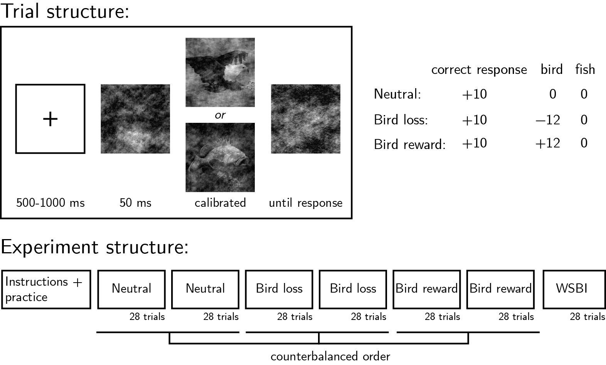

```{r setup, include = FALSE}
library("papaja")
library('dplyr')
library('tidyr')
library('tidyverse')
library('ggplot2')
library('jsonlite') # for WSBI
library('stringr')
library('ltm')
library('cocor')
library("fddm")
library('rstatix') # for ANOVA
library('psych') #for comparing correlations

r_refs("r-references.bib")
```

```{r analysis-preferences}
# Seed for random number generation
set.seed(42)
knitr::opts_chunk$set(cache.extra = knitr::rand_seed, warning = FALSE)
```


# Introduction

The year is 2021 and the world is experiencing a global pandemic. People routinely get tested for the virus: this is done by placing a sample on a test kit and waiting for the result, with the presence of the virus indicated by a test line emerging beneath the control line. You have a flight later today, so you take a test, really hoping for it to come out negative. You place the sample on the kit and patiently stare at it, waiting for the test line to emerge. Is your perception of the test line altered by your motivation not to see it? Do you selectively unsee the undesired outcome? Or maybe your motivation not to see the line is paradoxically making you more likely to perceive it?

Previous research indicates that what we want can determine what we see, or report to see. In addition to reports of increased sensitivity to reward-associated stimuli [@libera2006visual; @pessoa2010embedding], recent findings further suggest that motivation has a biasing effect on perception [@balcetis2012subjective; @leong2021pupil; @leong2019neurocomputational]. According to these studies, people are more likely to see what they want to see. For example, @leong2019neurocomputational presented participants with ambiguous overlays of face and scene images, with the face being more dominant in some trials, and the scene in others. Motivation was manipulated by associating face-dominant and scene-dominant images with a loss or gain of points on different trials. Even when informed that they should respond as accurately as possible, participants were more likely to report perceiving the rewarded stimulus – an effect that has been shown to reflect a combination of increased gain for motivated sensory representations in visual cortex and a non-perceptual decision bias, driven by subcortical mechanisms [@leong2021pupil; @leong2019neurocomputational]. 

These and similar findings reveal considerable influences of motivation on perception, but they leave open the question of whether these effects are driven by the enhancement of desired representations, the suppression of undesired representations, or both. It is difficult to arbitrate between these two mechanisms based on findings in the literature, because in most experimental paradigms the two stimulus categories are mutually exclusive and exhaustive. This makes the suppression of one category hard to dissociate from the enhancement of the alternative category; subjects may appear to enhance motivation-congruent representations, while in fact they suppress the representation of motivation-incongruent ones.

To address these open questions, we conducted six online experiments (N=100x6). In Experiments 1-3, subjects performed two alternative forced choice (2AFC) discrimination tasks. We compared the effects of reward and loss manipulations against a neutral condition, and found marked effects of loss on response bias, with no parallel effects for reward. In Experiments 4-6 we asked whether the effects of loss on decision bias reflected a suppression of the stimulus category associated with loss, or alternatively, an enhancement of the alternative stimulus category. In a detection task, associating stimulus absence or presence with loss resulted in weak and unstable biasing of the decision criterion. Drift diffusion modelling revealed suppression effects of motivation on drift rate for the undesired stimulus category, again in line with a motivated unseeing account. 

# Experiment 1

## Methods
We report how we determined our sample size, all data exclusions (if any), all manipulations, and all measures in the study. <!-- 21-word solution (Simmons, Nelson & Simonsohn, 2012; retrieved from http://ssrn.com/abstract=2160588) -->

### Participants

The study was approved by the Research Ethics Committee of Birkbeck, University of London (study ID number 2122050). Participants were recruited via Prolific, and gave informed consent prior to their participation. The criteria for recruitment were a Prolific approval rate of 95%, English as their first language, and an age between 18 and 60. The study took about 15 minutes, and participants were paid 7.5 pounds per hour. The top-performing 30% of participants received an additional bonus payment of £1.


### Procedure

Figure \@ref(fig:design) illustrates the experimental design. In a near-threshold categorisation task, participants reported whether they saw an image of a bird or a fish. At the beginning of the experiment, participants were given instructions and their understanding was then checked by a multiple-choice question. Then, participants were presented with a practice block, which was repeated until accuracy on the task reaches 75%. The practice round was followed by the main part of the experiment, comprising six blocks of 28 trials. At the beginning of each trial a fixation cross appeared on the screen for 500-1000 milliseconds, followed by three grayscale images: a forward mask (presented for 50 ms), the target image (presentation time calibrated to achieve 70% accuracy), and a backward mask (presented until a decision is made). All images were from the noisy animals stimulus set curated, processed, and kindly shared by, @meuwese2014subjective. Participants’ task was to judge whether the second image was of a bird or a fish. They were asked to indicate their decision using the J and F keys on the keyboard, counterbalanced across participants. The next trial did not begin until participants pressed one of these keys to indicate their decision. 

In addition to a base payment, participants were told that they could accumulate points in the task, and that these points will determine whether or not they get a bonus payment. Specifically, that a bonus payment of £1 will be given to the top 30% of highest performing participants. 

In all blocks, participants were told that correct responses award them with 10 points. In addition, on two  bird-reward blocks, bird images were rewarded with an extra 12 points, and on two bird-loss blocks, bird images were associated with a loss of 12 points. Two neutral blocks included gains or losses for birds. The order of the six blocks were randomized, with the constraint that the two blocks of each condition were always presented consequently. 

Importantly, in all blocks participants were motivated to make accurate judgments regarding the content of the presented image, but on some blocks the presence of a bird (regardless of their decision) was associated with a gain of points, while on others the presence of a bird was associated with a loss of points. Two multiple-choice questions ensured participants understood these instructions (for example, “To get many points I need to…” correct answer: “press F when the second image contained a bird and J when it contained a fish”, and not “press F as many times as possible”; “In addition to getting 10 points for accurate responses, in this block whenever a bird image is presented…” correct answer: “I automatically get 12 additional points”, and not “I get 12 additional points only if I pressed F”). Neutral blocks were preceded by the response mapping comprehension question (“To get many points I need to…” correct answer: “press F when the second image contained a bird and J when it contained a fish”). An additional question ("In addition to getting 10 points for accurate responses, in this block whenever a bird image is presented...", correct response: "I don't get or lose additional points") was presented only to those participants for which 'neutral' was not the first experimental condition. 

Task difficulty was calibrated by adjusting the target presentation time, starting at 60 ms and following a one-up-two-down procedure with a multiplicative step size of 0.9, which moved closer to 1 following each change in the direction of the calibration process. The calibration ran in the background throughout the entire task. 

Upon completion of the main part of the experiment, participants completed the white bear suppression inventory [@wegner1994chronic].


```{r design, echo=FALSE, fig.cap="Experimental design.Top left: Trial structure. The target image’s presentation time was calibrated to achieve 70% accuracy. Top right: incentive structure on different experimental blocks. Bottom: Overall experiment structure.", out.width = '75%'}

```

#### Randomization

The order and timing of experimental events was determined pseudo-randomly by the Mersenne Twister pseudorandom number generator, initialized in a way that ensures registration time-locking [@mazor2019novel]. 


### Rejection criteria

Participants were excluded if their accuracy fell below 50% in one or more experimental conditions (neutral, bird-loss, bird-reward). We also excluded participants for having extremely fast or slow reaction times in one or more of the tasks (below 100 milliseconds or above 5 seconds in more than 25% of the trials). Trials with response time below 100 milliseconds or above 5 seconds were excluded from the response-time analysis.

## Results

```{r load_and_format_data, echo=FALSE, cache=TRUE}
E1.raw_df <- read.table("../experiments/bird_fish/data/jatos_results_batch1.txt",sep=',', header=TRUE, colClasses=c("bird_key"="character")) %>%
  mutate(subj_id=PROLIFIC_PID,
         correct = correct=='true',
         RT = as.numeric(RT),
         resp = toupper(response)==toupper(bird_key),
         target_time = as.numeric(target_time));

E1.raw_disc_df <- E1.raw_df %>%
  filter(test_part=='neutral' | test_part=='bird_bonus' | test_part=='bird_loss')

E1.export <- read_csv('../experiments/bird_fish/data/prolific_export_batch1.csv')  %>%
  rename('subj_id' = 'participant_id')

E2.raw_df <- read.table("../experiments/fish_bird2/data/jatos_results_batch1.txt",sep=',', header=TRUE, colClasses=c("fish_key"="character")) %>%
  mutate(subj_id=PROLIFIC_PID,
         correct = correct=='true',
         RT = as.numeric(RT),
         resp = toupper(response)==toupper(fish_key),
         target_time = as.numeric(target_time))

E2.raw_disc_df <- E2.raw_df %>%
  filter(test_part=='neutral' | test_part=='fish_bonus' | test_part=='fish_loss')


E2.export <- read_csv('../experiments/fish_bird2/data/prolific_export_batch1.csv')  %>%
  rename('subj_id' = 'participant_id')

E3.raw_df <- read.csv("../experiments/gratings3/data/jatos_resultfiles_batch1/all_data.csv") %>%
  mutate(subj_id=PROLIFIC_PID,
         resp_orientation = ifelse(response=='j', 'right', 'left'),
         resp = resp_orientation==target_orientation,
         RT = as.numeric(RT),
         target_time = as.numeric(target_time));

E3.raw_disc_df <- E3.raw_df %>%
  filter(test_part=='neutral' | test_part=='bonus' | test_part=='loss')


E3.export <- read_csv('../experiments/gratings3/data/prolific_export_batch1.csv')  %>%
  rename('subj_id' = 'participant_id')


E4.raw_df <- read.table("../experiments/detection4/data/jatos_results_batch3.txt",sep=',', header=TRUE, colClasses=c("stripes_key"="character")) %>%
  mutate(subj_id=PROLIFIC_PID,
         RT = as.numeric(RT),
         target_time = as.numeric(target_time),
         correct = correct=='true',
         resp=response==tolower(stripes_key),
         test_part=ifelse(test_part=='WSBI','WBSI',test_part)) %>%
  filter(PROLIFIC_PID!='PROLIFIC_PID');

E4.raw_disc_df <- E4.raw_df %>%
  filter(test_part=='neutral' | test_part=='stripes_loss' | test_part=='noise_loss')


E4.export <- read_csv('../experiments/detection4/data/prolific_export_batch3.csv')  %>%
  rbind(read_csv('../experiments/detection4/data/prolific_export_batch3.1.csv'))  %>%
  rename('subj_id' = 'participant_id')

E5.raw_df <- read.table("../experiments/detection5/data/jatos_results_batch1.txt",sep=',', header=TRUE, colClasses=c("stripes_key"="character")) %>%
  mutate(subj_id=PROLIFIC_PID,
         RT = as.numeric(RT),
         target_time = as.numeric(target_time),
         correct = correct=='true',
         resp=response==tolower(stripes_key),
         test_part=ifelse(test_part=='WSBI','WBSI',test_part)) %>%
  filter(PROLIFIC_PID!='PROLIFIC_PID');

E5.raw_disc_df <- E5.raw_df %>%
  filter(test_part=='neutral' | test_part=='stripes_loss' | test_part=='noise_loss')


E5.export <- read_csv('../experiments/detection5/data/prolific_export_batch1.csv')  %>%
  rename('subj_id' = 'participant_id')


# In Exp. 6, batch 3 was accidentally run with visibility =0.4, and is therefore excluded
E6.raw_df <- read.table("../experiments/detection6/data/jatos_results_batch1.txt",sep=',', header=TRUE, colClasses=c("stripes_key"="character")) %>%
  rbind( read.table("../experiments/detection6/data/jatos_results_batch2.txt",sep=',', header=TRUE, colClasses=c("stripes_key"="character"))) %>%
  mutate(visibility = 0.05)%>%
  rbind( read.table("../experiments/detection6/data/jatos_results_batch4.txt",sep=',', header=TRUE, colClasses=c("stripes_key"="character"))) %>%
  mutate(subj_id=PROLIFIC_PID,
         RT = as.numeric(RT),
         target_time = as.numeric(target_time),
         correct = correct=='true',
         resp=response==tolower(stripes_key),
         test_part=ifelse(test_part=='WSBI','WBSI',test_part)) %>%
  filter(PROLIFIC_PID!='PROLIFIC_PID') %>%
  filter(!(subj_id %in% c("5a4b5c5135c9d50001fdd221", "5d95dfca33f8930017e85486", "616555ec3460f0a519c1cdff", "611d0c81b724fc22874aea50", "60d60ba4fd799e149121b85b", "61f2ab2fa09e72f23cbaf316", "59e32f80d838ae000185083c", "5ebd495e39fb6f017b95054a", "60b9f1fe58782eeab6372f1c", "5f3ec6221b5af3158bc86acd", "5f522c40069004482b3af322", "5b421b9ac2e3810001763252", "599a9252bbe848000179676e", "5f639c21192b540a86e6e559", "60fd4d2218f36f098dcb48ec", "5ee4aab1232e9d1b4d791bae", "596e1edd39e9d00001b7bb98", "5c84ed0cbda42300152f5952")));

# This last condition is because 18 subjects already took part in a previous experiment of this study,
# due to a bug on the Prolific system (we were reimbursed for these subjects and collected new participants instead of them)

E6.raw_disc_df <- E6.raw_df %>%
  filter(test_part=='neutral' | test_part=='stripes_loss' | test_part=='noise_loss')


E6.export <-
read_csv('../experiments/detection6/data/prolific_export_batch1.csv')  %>%
  rbind(read_csv('../experiments/detection6/data/prolific_export_batch2.csv'))%>%
  rbind(read_csv('../experiments/detection6/data/prolific_export_batch4.csv'))%>%
  rename('subj_id' = 'participant_id')


```

```{r comments, echo=FALSE, cache=TRUE}
E3.comments <- E3.raw_df %>%
  filter(trial_type=='survey-text') %>%
  dplyr::select(subj_id,response)

```

```{r comprehension, echo=FALSE, cache=TRUE}
E3.comprehension <- E3.raw_df%>%group_by(subj_id)%>% summarise(
    neutral = mean(neutral_instruction_repetitions),
    loss = mean(loss_instruction_repetitions),
    bonus = mean(bonus_instruction_repetitions)
)

```

```{r exclusion, echo=FALSE, cache=TRUE}


excludeSubjects <- function(raw_df, test_parts, to_exclude_technical, to_exclude_comprehension) {
  
  to_exclude_RT <- raw_df %>%
  filter(test_part %in% test_parts) %>%
  group_by(subj_id) %>%
  summarise(
    first_quartile_RT = quantile(RT,0.25),
    third_quartile_RT = quantile(RT,0.75)
  ) %>%
    filter(first_quartile_RT<100 | third_quartile_RT>5000) %>%
  pull(subj_id)
  
  # to_exclude_accuracy <- raw_df %>%
  # filter(test_part %in% test_parts) %>%
  # group_by(subj_id,test_part) %>%
  # summarise(
  #   accuracy = mean(correct)
  # ) %>%
  #   filter(accuracy<0.5) %>%
  # pull(subj_id) %>%
  # unique()
  
  to_exclude_accuracy <- raw_df %>%
  filter(test_part %in% test_parts) %>%
  group_by(subj_id,test_part) %>%
  summarise(
    accuracy = mean(correct)
  ) %>%
    group_by(subj_id) %>%
    summarise(min_acc=min(accuracy),
              avrg_acc=mean(accuracy))%>%
    filter(min_acc<=0.5) %>%
  pull(subj_id) %>%
  unique()
  
  filtered_df <- raw_df %>%
  filter(!(subj_id %in% to_exclude_accuracy | 
             subj_id %in% to_exclude_RT | 
             subj_id %in% to_exclude_technical | 
             subj_id %in% to_exclude_comprehension));

  return(filtered_df)
}

# some participants reported that some images didn't show, so we exclude them.
E1.to_exclude_technical <- c(
  '5f901c39da08ae0598da82d5',
  '610e5239f868e87f3b5a6087'
)

E1.df <- excludeSubjects(E1.raw_df,c('neutral','bird_loss','bird_bonus'),E1.to_exclude_technical,c())


E2.to_exclude_technical <- c(
  '5f1ffcf7eed8dd01d7ac91e4'
)

E2.df <- excludeSubjects(E2.raw_df,c('neutral','fish_loss','fish_bonus'),E2.to_exclude_technical,c())


E3.to_exclude_comprehension <- E3.raw_df %>%
  group_by(subj_id) %>%
  summarise(
    neutral_instruction_repetitions = mean(neutral_instruction_repetitions),
    loss_instruction_repetitions = mean(loss_instruction_repetitions),
    bonus_instruction_repetitions = mean(bonus_instruction_repetitions),
    max_instruction_repetitions = max(neutral_instruction_repetitions,loss_instruction_repetitions,bonus_instruction_repetitions)
  ) %>%
    filter(max_instruction_repetitions>3) %>%
  pull(subj_id) %>%
  unique()

E3.to_exclude_technical <- c(
)

E3.df <- excludeSubjects(E3.raw_df,c('neutral','loss','bonus'),E3.to_exclude_technical,E3.to_exclude_comprehension)


E4.to_exclude_comprehension <- E4.raw_df %>%
  group_by(subj_id) %>%
  summarise(
    neutral_instruction_repetitions = mean(as.integer(neutral_instruction_repetitions)),
    stripes_loss_instruction_repetitions = mean(as.integer(stripes_loss_instruction_repetitions)),
    noise_loss_instruction_repetitions = mean(as.integer(noise_loss_instruction_repetitions)),
    max_instruction_repetitions = max(neutral_instruction_repetitions,stripes_loss_instruction_repetitions,noise_loss_instruction_repetitions)
  ) %>%
    filter(max_instruction_repetitions>3) %>%
  pull(subj_id) %>%
  unique()

E4.to_exclude_technical <- c(
    '5eec48a2a0a86044492efa67'
)

E4.df <- excludeSubjects(E4.raw_df,c('neutral','noise_loss','stripes_loss'),E4.to_exclude_technical,E4.to_exclude_comprehension)


E5.to_exclude_comprehension <- E5.raw_df %>%
  group_by(subj_id) %>%
  summarise(
    neutral_instruction_repetitions = mean(as.integer(neutral_instruction_repetitions)),
    stripes_loss_instruction_repetitions = mean(as.integer(stripes_loss_instruction_repetitions)),
    noise_loss_instruction_repetitions = mean(as.integer(noise_loss_instruction_repetitions)),
    max_instruction_repetitions = max(neutral_instruction_repetitions,stripes_loss_instruction_repetitions,noise_loss_instruction_repetitions)
  ) %>%
    filter(max_instruction_repetitions>3) %>%
  pull(subj_id) %>%
  unique()

E5.to_exclude_technical <- c(
)

E5.df <- excludeSubjects(E5.raw_df,c('neutral','noise_loss','stripes_loss'),E5.to_exclude_technical,E5.to_exclude_comprehension)

E6.to_exclude_comprehension <- E6.raw_df %>%
  group_by(subj_id) %>%
  summarise(
    neutral_instruction_repetitions = mean(as.integer(neutral_instruction_repetitions)),
    stripes_loss_instruction_repetitions = mean(as.integer(stripes_loss_instruction_repetitions)),
    noise_loss_instruction_repetitions = mean(as.integer(noise_loss_instruction_repetitions)),
    max_instruction_repetitions = max(neutral_instruction_repetitions,stripes_loss_instruction_repetitions,noise_loss_instruction_repetitions)
  ) %>%
    filter(max_instruction_repetitions>3) %>%
  pull(subj_id) %>%
  unique()

# "56ce42d9465e580006846f57" reported that he systematically reported the stimulus that was not penalized. 
E6.to_exclude_technical <- c("56ce42d9465e580006846f57")

E6.df <- excludeSubjects(E6.raw_df,c('neutral','noise_loss','stripes_loss'),E6.to_exclude_technical,E6.to_exclude_comprehension)

```

```{r basic_stats, echo=FALSE, cache=TRUE}

 E1.N_total <- E1.raw_df$subj_id%>%unique()%>%length()
 E2.N_total <- E2.raw_df$subj_id%>%unique()%>%length()
 E3.N_total <- E3.raw_df$subj_id%>%unique()%>%length()
 E4.N_total <- E4.raw_df$subj_id%>%unique()%>%length()
 E5.N_total <- E5.raw_df$subj_id%>%unique()%>%length()
 E6.N_total <- E6.raw_df$subj_id%>%unique()%>%length()

 
E1.median_completion_time <-
    E1.export %>%
    filter(status=='APPROVED') %>%
    '$'('time_taken') %>%
    median()/60

E2.median_completion_time <-
    E2.export %>%
    filter(status=='APPROVED') %>%
    '$'('time_taken') %>%
    median()/60

E3.median_completion_time <-
    E3.export %>%
    filter(status=='APPROVED') %>%
    '$'('time_taken') %>%
    median()/60

E4.median_completion_time <-
    E4.export %>%
    filter(status=='APPROVED') %>%
    '$'('time_taken') %>%
    median()/60

E5.median_completion_time <-
    E5.export %>%
    filter(status=='APPROVED') %>%
    '$'('time_taken') %>%
    median()/60;


E6.median_completion_time <-
    E5.export %>%
    filter(status=='APPROVED') %>%
    '$'('time_taken') %>%
    median()/60
```

`r E1.N_total` participants were recruited from Prolific for Experiment 1.

Median completion time was `r printnum(E1.median_completion_time)` minutes. Mean accuracy was `r printnum(E1.raw_disc_df$correct%>%mean())`. Participants reported seeing a bird on `r printnum(E1.raw_disc_df$resp%>%mean())` of the trials. Overall we excluded `r E1.N_total-E1.df$subj_id%>%unique()%>%length()` participants based on our exclusion criteria, leaving `r E1.df$subj_id%>%unique()%>%length()` participants for the main analysis. 

```{r bias, echo=FALSE, cache=TRUE}

getBias <- function(df,test_parts) {
  
  bias <- df %>%
  filter(test_part %in% test_parts) %>%
  group_by(subj_id,test_part) %>%
  summarise(
    bias = mean(resp)
  ) %>%
  spread(test_part,bias) 
  
  return(bias)
}

getBiasFirstBlock <- function(df) {
  
  bias_first_block <- df %>%
   filter(test_part==first_condition) %>%
   group_by(subj_id,test_part) %>%
    summarise(
      bias = mean(resp)
    )
  
  return(bias_first_block)
  
}

E1.bias <- E1.df %>%
 getBias(c('neutral','bird_loss','bird_bonus')) %>%
  mutate(loss_effect = bird_loss-neutral,
         gain_effect = bird_bonus-neutral)

E1.bias_first_block <- E1.df %>%
   getBiasFirstBlock()

E2.bias <- E2.df %>%
  getBias(c('neutral','fish_loss','fish_bonus'))%>%
  mutate(loss_effect = fish_loss-neutral,
         gain_effect = fish_bonus-neutral)

E2.bias_first_block <- E2.df %>%
   getBiasFirstBlock()

E3.bias <- E3.df %>%
  getBias(c('neutral','loss','bonus')) %>%
  mutate(loss_effect = loss-neutral,
         gain_effect = bonus-neutral)

E3.bias_first_block <- E3.df %>%
  getBiasFirstBlock()

E4.bias <- E4.df %>%
  getBias(c('neutral','noise_loss','stripes_loss')) %>%
  mutate(noise_loss_effect = noise_loss-neutral,
         stripes_loss_effect = stripes_loss-neutral,
         interaction = noise_loss_effect+stripes_loss_effect)

E4.bias_first_block <- E4.df %>%
  getBiasFirstBlock()


E5.bias <- E5.df  %>%
  getBias(c('neutral','noise_loss','stripes_loss')) %>%
  mutate(noise_loss_effect = noise_loss-neutral,
         stripes_loss_effect = stripes_loss-neutral,
         interaction = noise_loss_effect+stripes_loss_effect)

E5.bias_first_block <- E5.df%>%
  getBiasFirstBlock()

E6.bias <- E6.df  %>%
  getBias(c('neutral','noise_loss','stripes_loss')) %>%
  mutate(noise_loss_effect = noise_loss-neutral,
         stripes_loss_effect = stripes_loss-neutral,
         interaction = noise_loss_effect+stripes_loss_effect)

E6.bias_first_block <- E6.df%>%
  getBiasFirstBlock()
```

```{r presentation_time, echo=FALSE, cache=TRUE}

getPT <- function(df,test_parts) {
  
  PT <- df %>%
  filter(test_part %in% test_parts) %>%
  group_by(subj_id,test_part) %>%
  mutate(measured_PT=as.double(measured_number_of_frames))%>%
  filter(is.finite(measured_PT))%>%
  summarise(
    PT = median(measured_PT)
  ) %>%
  spread(test_part,PT) 
  
  return(PT)
}

getMaxPT <- function(df,test_parts) {
  
  PT <- df %>%
  filter(test_part %in% test_parts) %>%
  group_by(subj_id,test_part) %>%
  mutate(measured_PT=as.double(measured_presentation_time))%>%
  filter(is.finite(measured_PT))%>%
  summarise(
    PT = max(measured_PT)
  ) %>%
  spread(test_part,PT) 
  
  return(PT)
}


E1.PT <- E1.df %>%
 getPT(c('neutral','bird_loss','bird_bonus')) %>%
  mutate(loss_effect = bird_loss-neutral,
         gain_effect = bird_bonus-neutral)

E2.PT <- E2.df %>%
  getPT(c('neutral','fish_loss','fish_bonus'))%>%
  mutate(loss_effect = fish_loss-neutral,
         gain_effect = fish_bonus-neutral)

E3.PT <- E3.df %>%
  getPT(c('neutral','loss','bonus')) %>%
  mutate(loss_effect = loss-neutral,
         gain_effect = bonus-neutral)


E4.PT <- E4.df %>%
  getPT(c('neutral','noise_loss','stripes_loss')) %>%
  mutate(noise_loss_effect = noise_loss-neutral,
         stripes_loss_effect = stripes_loss-neutral,
         interaction = noise_loss_effect+stripes_loss_effect)


E5.PT <- E5.df  %>%
  getPT(c('neutral','noise_loss','stripes_loss')) %>%
  mutate(noise_loss_effect = noise_loss-neutral,
         stripes_loss_effect = stripes_loss-neutral,
         interaction = noise_loss_effect+stripes_loss_effect)

E6.PT <- E6.df  %>%
  getPT(c('neutral','noise_loss','stripes_loss')) %>%
  mutate(noise_loss_effect = noise_loss-neutral,
         stripes_loss_effect = stripes_loss-neutral,
         interaction = noise_loss_effect+stripes_loss_effect)

E6.bias_first_block <- E6.df%>%
  getBiasFirstBlock()
```

```{r bias-plots, echo=FALSE, cache=TRUE}

discrimination.bias <- E1.bias %>%
  mutate(Exp=1) %>%
  rename(loss=bird_loss,
         bonus=bird_bonus) %>%
  rbind(E2.bias %>%
          mutate(Exp=2) %>%
          rename(loss=fish_loss,
                 bonus=fish_bonus)) %>%
  rbind(E3.bias %>%
          mutate(Exp=3)) %>%
  mutate(Exp=factor(Exp,
                    levels=c(1,2,3),
                    labels=c('Exp. 1','Exp. 2', 'Exp. 3')))
  
  discrimination.bias_conditions <- discrimination.bias %>%
    pivot_longer(
      cols = bonus:neutral,
      names_to='condition',
      values_to='bias'
    ) %>%
    dplyr::select(c('subj_id','Exp','condition','bias'))
  
   discrimination.bias_effects <- discrimination.bias %>%
    pivot_longer(
      cols = loss_effect:gain_effect,
      names_to='contrast',
      values_to='effect'
    ) %>%
     mutate(contrast = factor(contrast, 
                              levels=c('gain_effect','loss_effect'), 
                              labels=c('gain','loss')),
            effect=effect*100)%>%
    dplyr::select(c('subj_id','Exp','contrast','effect'))
   
p <- discrimination.bias_effects %>% 
  ggplot(aes(x=Exp,y=effect)) +
  geom_abline(slope=0,intercept=0,color='black', size=1,)+
  geom_violin(draw_quantiles = c(0.5), size=1, color='black') +
  geom_point(position = position_jitter(seed = 1, width = 0.2), alpha=0.1, size=2, color='black') +
  facet_wrap(~contrast) + 
  # scale_color_manual(values=c("#fe6100", "#785ef0"))+
  theme_bw() + 
  theme(legend.position='none')+
  labs(y='Response bias effect (%)') 

ggsave('figures/discrimination_bias.png',p,width=4,height=4,dpi=300)

detection.bias <- E4.bias %>%
  mutate(Exp=4)  %>%
  rbind(E5.bias %>%
          mutate(Exp=5)) %>%
  rbind(E6.bias %>%
          mutate(Exp=6)) %>%
  mutate(Exp=factor(Exp,
                    levels=c(4,5,6),
                    labels=c('Exp. 4','Exp. 5', 'Exp. 6')))

 detection.bias_effects <- detection.bias %>%
    pivot_longer(
      cols = noise_loss_effect:stripes_loss_effect,
      names_to='contrast',
      values_to='effect'
    ) %>%
     mutate(contrast = factor(contrast, 
                              levels=c('noise_loss_effect','stripes_loss_effect'), 
                              labels=c('absence loss','presence loss')),
            effect=effect*100)%>%
    dplyr::select(c('subj_id','Exp','contrast','effect'))
 
 p <- detection.bias_effects %>% 
  ggplot(aes(x=Exp,y=effect)) +
  geom_abline(slope=0,intercept=0,color='black', size=1,)+
  geom_violin(draw_quantiles = c(0.5), size=1, color='black') +
  geom_point(position = position_jitter(seed = 1, width = 0.2), alpha=0.1, size=2, color='black') +
  facet_wrap(~contrast) + 
  # scale_color_manual(values=c("#fe6100", "#785ef0"))+
  theme_bw() + 
  theme(legend.position='none')+
  labs(y='Response bias effect (%)')
 
 ggsave('figures/detection_bias.png',p,width=4,height=4,dpi=300)


```


```{r SDT, echo=FALSE, cache=TRUE}

getSDT <- function(df, test_parts) {
  
  sdt <- df %>%
  filter(test_part %in% test_parts) %>%
  group_by(subj_id,test_part) %>%
  summarise(
    h = sum(correct & resp),
    fa = sum(!correct & resp),
    cr = sum(correct & !resp),
    m = sum(!correct & !resp),
    accuracy = mean(correct),
    bias = mean(resp)
  ) %>%
  mutate(
    hit_rate = (h+0.5)/(h+m+1),
    fa_rate = (fa+0.5)/(fa+cr+1),
    dprime = qnorm(hit_rate)-qnorm(fa_rate),
    criterion = -(qnorm(hit_rate)+qnorm(fa_rate))/2
  )
  
  return(sdt)
}

getSDTFirstBlock <- function(df) {
  
  sdt <- df %>%
  filter(test_part == first_condition) %>%
  group_by(subj_id,test_part) %>%
  summarise(
    h = sum(correct & resp),
    fa = sum(!correct & resp),
    cr = sum(correct & !resp),
    m = sum(!correct & !resp),
    accuracy = mean(correct),
    bias = mean(resp)
  ) %>%
  mutate(
    hit_rate = (h+0.5)/(h+m+1),
    fa_rate = (fa+0.5)/(fa+cr+1),
    dprime = qnorm(hit_rate)-qnorm(fa_rate),
    criterion = -(qnorm(hit_rate)+qnorm(fa_rate))/2
  )
  
  return(sdt)
}


E1.sdt <- E1.df %>%
  getSDT(c('neutral', 'bird_loss', 'bird_bonus'))

E1.sdt_first_block <- E1.df %>%
  getSDTFirstBlock()

E1.c <- E1.sdt %>%
  dplyr::select(subj_id,test_part,criterion) %>%
  spread(test_part,criterion) %>%
  mutate(loss_effect = bird_loss-neutral,
         bonus_effect = bird_bonus-neutral)

E1.d <- E1.sdt %>%
  dplyr::select(subj_id,test_part,dprime) %>%
  spread(test_part,dprime)

E2.sdt <- E2.df %>%
  getSDT(c('neutral', 'fish_loss', 'fish_bonus'))

E2.sdt_first_block <- E2.df %>%
  getSDTFirstBlock()

E2.c <- E2.sdt %>%
  dplyr::select(subj_id,test_part,criterion) %>%
  spread(test_part,criterion)%>%
  mutate(loss_effect = fish_loss-neutral,
         bonus_effect = fish_bonus-neutral)

E2.d <- E2.sdt %>%
  dplyr::select(subj_id,test_part,dprime) %>%
  spread(test_part,dprime)

E3.sdt <- E3.df %>%
  getSDT(c('neutral', 'loss', 'bonus'))

E3.sdt_first_block <- E3.df %>%
  getSDTFirstBlock()

E3.c <- E3.sdt %>%
  dplyr::select(subj_id,test_part,criterion) %>%
  spread(test_part,criterion) %>%
  mutate(loss_effect = loss-neutral,
         bonus_effect = bonus-neutral)

E3.d <- E3.sdt %>%
  dplyr::select(subj_id,test_part,dprime) %>%
  spread(test_part,dprime)

E4.sdt <- E4.df %>%
  getSDT(c('neutral','noise_loss','stripes_loss'))

E4.sdt_first_block <- E4.df %>%
  getSDTFirstBlock()

E4.c <- E4.sdt %>%
  dplyr::select(subj_id,test_part,criterion) %>%
  spread(test_part,criterion) %>%
  mutate(stripes_loss_effect = stripes_loss-neutral,
         noise_loss_effect = noise_loss-neutral)

E4.d <- E4.sdt %>%
  dplyr::select(subj_id,test_part,dprime) %>%
  spread(test_part,dprime)

E5.sdt <- E5.df %>%
  getSDT(c('neutral','noise_loss','stripes_loss'))

E5.sdt_first_block <- E5.df %>%
  getSDTFirstBlock()

E5.c <- E5.sdt %>%
  dplyr::select(subj_id,test_part,criterion) %>%
  spread(test_part,criterion) %>%
  mutate(stripes_loss_effect = stripes_loss-neutral,
         noise_loss_effect = noise_loss-neutral)

E5.d <- E5.sdt %>%
  dplyr::select(subj_id,test_part,dprime) %>%
  spread(test_part,dprime)

E6.sdt <- E6.df %>%
  getSDT(c('neutral','noise_loss','stripes_loss'))

E6.sdt_first_block <- E6.df %>%
  getSDTFirstBlock()

E6.c <- E6.sdt %>%
  dplyr::select(subj_id,test_part,criterion) %>%
  spread(test_part,criterion) %>%
  mutate(stripes_loss_effect = stripes_loss-neutral,
         noise_loss_effect = noise_loss-neutral)

E6.d <- E6.sdt %>%
  dplyr::select(subj_id,test_part,dprime) %>%
  spread(test_part,dprime)

```


First, we asked whether our reward manipulation had an effect on response bias. The proportion of reports of seeing a bird was similar on bird-reward (`r E1.bias$bird_bonus%>%mean()%>%printnum()`) and neutral (`r E1.bias$neutral%>%mean()%>%printnum()`) blocks (`r E1.bias$gain_effect%>%t.test()%>%apa_print()%>%'$'(full_result)`). In contrast, associating bird stimuli with point loss had a robust effect on response bias: the proportion of reports of seeing a bird on bird-loss blocks (`r E1.bias$bird_loss%>%mean()%>%printnum()`) was significantly lower compared to in neutral blocks (`r E1.bias$loss_effect%>%t.test()%>%apa_print()%>%'$'(full_result)`). 

```{r RT, echo=FALSE, cache=TRUE}

getRT <- function(df, test_parts, responses) {
  
  RT <- df %>%
  filter(test_part %in% test_parts) %>%
  filter(RT>=100 & RT<=5000)%>%
  mutate(resp = ifelse(resp, responses[1],responses[2])) %>%
  group_by(subj_id,test_part,resp) %>%
  summarise(
    RT = median(RT)
  ) %>%
  pivot_wider(id_cols=subj_id,names_from=c(test_part,resp),values_from=RT)
  
  return(RT)
}

getRTFirstBlock <- function(df, responses) {
  
  RT <- df %>%
  filter(test_part==first_condition)%>%
  filter(RT>=100 & RT<=5000)%>%
  mutate(resp = ifelse(resp, responses[1],responses[2])) %>%
  group_by(subj_id,test_part,resp) %>%
  summarise(
    RT = median(RT)
  ) %>%
  spread(resp,RT)
  
  return(RT)
}

E1.RT <- E1.df %>%
  getRT(c('neutral','bird_loss','bird_bonus'),c('bird','fish')) %>%
  mutate(H3 = bird_bonus_bird-neutral_bird,
         H4 = bird_bonus_fish-neutral_fish,
         H5 = bird_loss_bird-neutral_bird,
         H6 = bird_loss_fish-neutral_fish,
         bonus_effect = bird_bonus_bird-bird_bonus_fish,
         loss_effect = bird_loss_fish-bird_loss_bird)

E1.RT_correct <- E1.df %>%
  filter(correct==1) %>%
  getRT(c('neutral','bird_loss','bird_bonus'),c('bird','fish')) %>%
  mutate(H3 = bird_bonus_bird-neutral_bird,
         H4 = bird_bonus_fish-neutral_fish,
         H5 = bird_loss_bird-neutral_bird,
         H6 = bird_loss_fish-neutral_fish,
         bonus_effect = bird_bonus_bird-bird_bonus_fish,
         loss_effect = bird_loss_fish-bird_loss_bird)
E1.RT_first_block <- E1.df %>%
  getRTFirstBlock(c('bird','fish')) %>%
  mutate(diff=bird-fish)

E1.RT_anova <- E1.df %>%
  filter(test_part %in% c('neutral','bird_loss','bird_bonus')) %>%
  filter(RT>=100 & RT<=5000 & correct==1) %>%
  group_by(subj_id,test_part,resp) %>%
  summarise(RT=median(RT)) %>%
  mutate(subj_id=factor(subj_id),
         resp=factor(resp),
         condition=factor(test_part))%>%
  rowwise()%>%
  anova_test(RT~condition*resp+Error(subj_id/condition*resp))

E2.RT <- E2.df %>%
  getRT(c('neutral','fish_loss','fish_bonus'),c('fish','bird')) %>%
  mutate(H3 = fish_bonus_fish-neutral_fish,
         H4 = fish_bonus_bird-neutral_bird,
         H5 = fish_loss_fish-neutral_fish,
         H6 = fish_loss_bird-neutral_bird,
         bonus_effect = fish_bonus_fish-fish_bonus_bird,
         loss_effect = fish_loss_bird-fish_loss_fish)

E2.RT_correct <- E2.df %>%
  filter(correct==1) %>%
  getRT(c('neutral','fish_loss','fish_bonus'),c('fish','bird')) %>%
  mutate(H3 = fish_bonus_fish-neutral_fish,
         H4 = fish_bonus_bird-neutral_bird,
         H5 = fish_loss_fish-neutral_fish,
         H6 = fish_loss_bird-neutral_bird,
         bonus_effect = fish_bonus_fish-fish_bonus_bird,
         loss_effect = fish_loss_bird-fish_loss_fish)

E2.RT_anova <- E2.df %>%
  filter(test_part %in% c('neutral','fish_loss','fish_bonus')) %>%
  filter(RT>=100 & RT<=5000 & correct==1) %>%
  group_by(subj_id,test_part,resp) %>%
  summarise(RT=median(RT)) %>%
  mutate(subj_id=factor(subj_id),
         resp=factor(resp),
         condition=factor(test_part))%>%
  rowwise()%>%
  anova_test(RT~condition*resp+Error(subj_id/condition*resp))

E2.RT_first_block <- E2.df %>%
  getRTFirstBlock(c('fish','bird')) %>%
  mutate(diff=fish-bird)

E3.RT <- E3.df %>%
  getRT(c('neutral','loss','bonus'),c('target','nontarget')) %>%
  mutate(H3 = bonus_target-neutral_target,
         H4 = bonus_nontarget-neutral_nontarget,
         H5 = loss_target-neutral_target,
         H6 = loss_nontarget-neutral_nontarget,
         bonus_effect = bonus_target-bonus_nontarget,
         loss_effect = loss_nontarget-loss_target)

E3.RT_first_block <- E3.df %>%
  getRTFirstBlock(c('target','nontarget')) %>%
  mutate(diff=target-nontarget)

E3.RT_correct <- E3.df %>%
  filter(correct==1) %>%
  getRT(c('neutral','loss','bonus'),c('target','nontarget')) %>%
  mutate(H3 = bonus_target-neutral_target,
         H4 = bonus_nontarget-neutral_nontarget,
         H5 = loss_target-neutral_target,
         H6 = loss_nontarget-neutral_nontarget,
         bonus_effect = bonus_target-bonus_nontarget,
         loss_effect = loss_nontarget-loss_target)

E3.RT_anova <- E3.df %>%
  filter(test_part %in% c('neutral','loss','bonus')) %>%
  filter(RT>=100 & RT<=5000 & correct==1) %>%
  group_by(subj_id,test_part,resp) %>%
  summarise(RT=median(RT)) %>%
  mutate(subj_id=factor(subj_id),
         resp=factor(resp),
         condition=factor(test_part))%>%
  rowwise()%>%
  anova_test(RT~condition*resp+Error(subj_id/condition*resp))

E4.RT <- E4.df %>%
  getRT(c('neutral','noise_loss','stripes_loss'),c('stripes','noise'))%>%
  mutate(H4 = stripes_loss_stripes-neutral_stripes,
         H5 = stripes_loss_noise-neutral_noise,
         H6 = noise_loss_stripes-neutral_stripes,
         H7 = noise_loss_noise-neutral_noise,
         stripes_loss_effect = stripes_loss_stripes-stripes_loss_noise,
         noise_loss_effect = noise_loss_noise-noise_loss_stripes)

E4.RT_first_block <- E4.df %>%
  getRTFirstBlock(c('stripes','noise')) %>%
  mutate(diff=stripes-noise)

E4.RT_correct <- E4.df %>%
  filter(correct==1) %>%
  getRT(c('neutral','noise_loss','stripes_loss'),c('stripes','noise'))%>%
  mutate(H4 = stripes_loss_stripes-neutral_stripes,
         H5 = stripes_loss_noise-neutral_noise,
         H6 = noise_loss_stripes-neutral_stripes,
         H7 = noise_loss_noise-neutral_noise,
         stripes_loss_effect = stripes_loss_stripes-stripes_loss_noise,
         noise_loss_effect = noise_loss_noise-noise_loss_stripes)


E4.RT_anova <- E4.df %>%
  filter(test_part %in% c('neutral','stripes_loss','noise_loss')) %>%
  filter(RT>=100 & RT<=5000 & correct==1) %>%
  group_by(subj_id,test_part,resp) %>%
  summarise(RT=median(RT)) %>%
  mutate(subj_id=factor(subj_id),
         resp=factor(resp),
         condition=factor(test_part))%>%
  rowwise()%>%
  anova_test(RT~condition*resp+Error(subj_id/condition*resp))

E4.RT_by_resp <- E4.df %>%
  filter(test_part %in% c('neutral','stripes_loss','noise_loss')) %>%
  filter(RT>=100 & RT<=5000 & correct==1) %>%
  group_by(subj_id,resp) %>%
  summarise(RT=median(RT)) %>%
  spread(resp,RT,sep='.') %>%
  mutate(diff=resp.FALSE-resp.TRUE)

E5.RT <- E5.df %>%
  getRT(c('neutral','noise_loss','stripes_loss'),c('stripes','noise'))%>%
  mutate(H4 = stripes_loss_stripes-neutral_stripes,
         H5 = stripes_loss_noise-neutral_noise,
         H6 = noise_loss_stripes-neutral_stripes,
         H7 = noise_loss_noise-neutral_noise,
         stripes_loss_effect = stripes_loss_stripes-stripes_loss_noise,
         noise_loss_effect = noise_loss_noise-noise_loss_stripes)

E5.RT_anova <- E5.df %>%
  filter(test_part %in% c('neutral','stripes_loss','noise_loss')) %>%
  filter(RT>=100 & RT<=5000 & correct==1) %>%
  group_by(subj_id,test_part,resp) %>%
  summarise(RT=median(RT)) %>%
  mutate(subj_id=factor(subj_id),
         resp=factor(resp),
         condition=factor(test_part))%>%
  rowwise()%>%
  anova_test(RT~condition*resp+Error(subj_id/condition*resp))

E5.RT_by_resp <- E5.df %>%
  filter(test_part %in% c('neutral','stripes_loss','noise_loss')) %>%
  filter(RT>=100 & RT<=5000 & correct==1) %>%
  group_by(subj_id,resp) %>%
  summarise(RT=median(RT)) %>%
  spread(resp,RT,sep='.') %>%
  mutate(diff=resp.FALSE-resp.TRUE)

E5.RT_by_condition <- E5.df %>%
  filter(test_part %in% c('neutral','stripes_loss','noise_loss')) %>%
  filter(RT>=100 & RT<=5000 & correct==1) %>%
  group_by(subj_id,test_part) %>%
  summarise(RT=median(RT)) %>%
  spread(test_part, RT) %>%
  mutate(diff_stripes=stripes_loss-neutral,
         diff_noise = noise_loss-neutral,
         diff_losses = stripes_loss-noise_loss)

E5.RT_first_block <- E5.df %>%
  getRTFirstBlock(c('stripes','noise')) %>%
  mutate(diff=stripes-noise)

E5.RT_correct <- E5.df %>%
  filter(correct==1) %>%
  getRT(c('neutral','noise_loss','stripes_loss'),c('stripes','noise'))%>%
  mutate(H4 = stripes_loss_stripes-neutral_stripes,
         H5 = stripes_loss_noise-neutral_noise,
         H6 = noise_loss_stripes-neutral_stripes,
         H7 = noise_loss_noise-neutral_noise,
         stripes_loss_effect = stripes_loss_stripes-stripes_loss_noise,
         noise_loss_effect = noise_loss_noise-noise_loss_stripes)

E6.RT <- E6.df %>%
  getRT(c('neutral','noise_loss','stripes_loss'),c('stripes','noise'))%>%
  mutate(H4 = stripes_loss_stripes-neutral_stripes,
         H5 = stripes_loss_noise-neutral_noise,
         H6 = noise_loss_stripes-neutral_stripes,
         H7 = noise_loss_noise-neutral_noise,
         stripes_loss_effect = stripes_loss_stripes-stripes_loss_noise,
         noise_loss_effect = noise_loss_noise-noise_loss_stripes)

E6.RT_anova <- E6.df %>%
  filter(test_part %in% c('neutral','stripes_loss','noise_loss')) %>%
  filter(RT>=100 & RT<=5000 & correct==1) %>%
  group_by(subj_id,test_part,resp) %>%
  summarise(RT=median(RT)) %>%
  mutate(subj_id=factor(subj_id),
         resp=factor(resp),
         condition=factor(test_part))%>%
  rowwise()%>%
  anova_test(RT~condition*resp+Error(subj_id/condition*resp))

E6.RT_by_resp <- E6.df %>%
  filter(test_part %in% c('neutral','stripes_loss','noise_loss')) %>%
  filter(RT>=100 & RT<=5000 & correct==1) %>%
  group_by(subj_id,resp) %>%
  summarise(RT=median(RT)) %>%
  spread(resp,RT,sep='.') %>%
  mutate(diff=resp.FALSE-resp.TRUE)

E6.RT_by_condition <- E6.df %>%
  filter(test_part %in% c('neutral','stripes_loss','noise_loss')) %>%
  filter(RT>=100 & RT<=5000 & correct==1) %>%
  group_by(subj_id,test_part) %>%
  summarise(RT=median(RT)) %>%
  spread(test_part, RT) %>%
  mutate(diff_stripes=stripes_loss-neutral,
         diff_noise = noise_loss-neutral,
         diff_losses = stripes_loss-noise_loss)

E6.RT_first_block <- E6.df %>%
  getRTFirstBlock(c('stripes','noise')) %>%
  mutate(diff=stripes-noise)

E6.RT_correct <- E6.df %>%
  filter(correct==1) %>%
  getRT(c('neutral','noise_loss','stripes_loss'),c('stripes','noise'))%>%
  mutate(H4 = stripes_loss_stripes-neutral_stripes,
         H5 = stripes_loss_noise-neutral_noise,
         H6 = noise_loss_stripes-neutral_stripes,
         H7 = noise_loss_noise-neutral_noise,
         stripes_loss_effect = stripes_loss_stripes-stripes_loss_noise,
         noise_loss_effect = noise_loss_noise-noise_loss_stripes)
```
Response time analysis revealed no main effects of condition or response, and no interaction between the two (all $F$s <1). Specifically, response times to bird stimuli were unaffected by the reward (`r E1.RT$H3%>%t.test()%>%apa_print%>%'$'(full_result)` and loss (`r E1.RT$H5%>%t.test()%>%apa_print%>%'$'(full_result)`) manipulations. Similarly, response times to fish stimuli were unaffected by the reward (`r E1.RT$H4%>%t.test()%>%apa_print%>%'$'(full_result)`) and loss (`r E1.RT$H6%>%t.test()%>%apa_print%>%'$'(full_result)`) manipulations. 

# Experiment 2

In Exp. 1, we found that participants had an overall bias to report seeing birds, and that this response bias disappeared when bird images were associated with losing points. However, and in contrast with previous reports of motivated perception [@balcetis2012subjective; @leong2021pupil; @leong2019neurocomputational], we found no effect of associating bird images with a reward on response bias. Since fish images were never associated with the loss of gain of points, we could not tell whether this loss/reward asymmetry reflects an asymmetry between our reward and loss manipulations, such that only the loss manipulation is effective, or alternatively, whether it reflects an asymmetry in the perception of birds and fish (such that fish images are more amenable to enhancement, or bird images more amenable to suppression). To this end, Exp. 2 replicated the results of Exp. 1 with one critical change: the loss or gain of points was associated with fish, rather than bird images.

## Methods

Exp. 2 was identical to Exp. 1 with the sole difference that fish images, instead of bird images, were associated with loss or gain of points. 

## Results

`r E2.N_total` participants were recruited from Prolific for Experiment 1.

Median completion time was `r printnum(E2.median_completion_time)` minutes. Mean accuracy was `r printnum(E2.raw_disc_df$correct%>%mean())`. Participants reported seeing a bird on `r printnum(1-E2.raw_disc_df$resp%>%mean())` of the trials. Overall, we excluded `r E2.N_total-E2.df$subj_id%>%unique()%>%length()` participants based on our exclusion criteria, leaving `r E2.df$subj_id%>%unique()%>%length()` participants for the main analysis. 

Similar to Exp. 1, here too only the loss manipulation was effective in biasing participants responses relative to a neutral baseline. The proportion of reports of seeing a fish was similar on fish-reward (`r E2.bias$fish_bonus%>%mean()%>%printnum()`) and neutral (`r E2.bias$neutral%>%mean()%>%printnum()`) blocks (`r E2.bias$gain_effect%>%t.test()%>%apa_print()%>%'$'(full_result)`). In contrast, the proportion of reports of seeing a fish on fish-loss blocks (`r E2.bias$fish_loss%>%mean()%>%printnum()`) was significantly lower compared to in neutral blocks (`r E2.bias$loss_effect%>%t.test()%>%apa_print()%>%'$'(full_result)`). 

In Exp. 2, a repeated measured analysis of variance revealed a significant effect of response (bird or fish; $F(1,92)=4.784,p=.031$). The motivation manipulations had no significant effect on response time ($F(2,194)=2.661,p=.073$), and there was no interaction between response and condition ($F$<1). 

Despite the absence of a main effect for condition, we followed our pre-registered reaction time analysis for response times (see [osf.io/nj9es](https://osf.io/nj9es)). This analysis revealed that response times for fish (target) images were significantly slower in fish-reward (median RT: `r E2.RT$fish_bonus_fish%>%median%>%round()` ms) compared to neutral blocks (median RT: `r E2.RT$neutral_fish%>%median%>%round()` ms; `r E2.RT$H3%>%t.test()%>%apa_print%>%'$'(full_result)`; Wilcoxon sign rank test: `r E2.RT$H3%>%wilcox.test()%>%apa_print%>%'$'(full_result)`). A smaller difference of `r E2.RT$H4%>%mean(na.rm=T)%>%printnum()` ms between bird responses in reward and neutral blocks was not significant (`r E2.RT$H4%>%t.test()%>%apa_print%>%'$'(statistic)`). The loss manipulation had no effect on fish (`r E2.RT$H5%>%t.test()%>%apa_print%>%'$'(full_result)` or bird (`r E2.RT$H6%>%t.test()%>%apa_print%>%'$'(full_result)`) response times.


```{r figure, cache=TRUE, echo=FALSE}
p <- E1.df %>%
  mutate(test_part=ifelse(test_part=='neutral','bird_neutral',test_part))%>%
  bind_rows(E2.df %>%
              mutate(test_part=ifelse(test_part=='neutral','fish_neutral',test_part),
                           resp=1-resp))%>%
  filter(test_part=='bird_neutral' | test_part=='bird_loss' | test_part =='bird_bonus' | test_part=='fish_neutral' | test_part=='fish_loss' | test_part =='fish_bonus') %>%
  group_by(subj_id,test_part) %>%
  summarise(
    bias = mean(resp)
  ) %>% 
  ggplot(aes(x=test_part ,y=bias, colour=test_part)) +
  geom_boxplot(size=1,fill='white',outlier.alpha=0) +
  geom_jitter(alpha=0.3,size=2, show.legend=FALSE)+
  theme_classic() + 
  labs(x='condition', y='proportion of bird responses')

ggsave('figures/E1_bias_by_condition.png',p,width=5,height=4.5)

```

# Experiment 3

Exp. 2 confirmed that the absence of a reward effect in Exp. 1 was not due to differences between the representation of bids and fish. Instead, in the first two experiments we found no effect of associating bird or fish images with a reward on response bias on decision time. 

We considered two candidate reasons for our failure to observe an effect of motivation on perception. First, it may be that a bonus payment of £1 was insufficient to reliably affect participants' behaviour. For comparison, @leong2019neurocomputational offered up to \$20 of bonus (67% of the base payment), @leong2021pupil offered up to \$10 (50% of the base payment) and @balcetis2012subjective offered a raffle ticket with a top prize of \$100 (1000% of the base payment). Second, we considered the possibility that our stimuli were perceived as emotionally aversive, rendering them more difficult to associate with a positive outcome. Previous studies used face/scene images [@leong2021pupil; @leong2019neurocomputational] or numbers and letters [@balcetis2012subjective] which are perhaps more neutral. 

In Exp. 3 we have made several changes to our paradigm, to increase our sensitivity to effects of motivation on perception. First, we increased our bonus payment, and offered to double the payment of the highest scoring 30% of our subjects, and triple the payment of the highest scoring 5%. We also included a leaderboard screen to increase motivation. Second, instead of fish and bird images, we used emotionally neutral noisy grating images as stimuli. Finally, to make sure that subjects fully understand that only the accuracy of their responses affects their bonus payment, we included two additional lures to our comprehension questions.

## Methods

In a near-threshold categorisation task, participants reported whether a noisy grating was tilted to the right (clockwise) or to the left (anticlockwise). At the beginning of each trial a fixation cross appeared on the screen for 500-1000 milliseconds, followed by three grayscale images: a forward mask (presented for 50 ms), the target image (presentation time calibrated to achieve 70% accuracy), and a backward mask (presented until a decision is made). The forward and backward masks comprised black and white concentric circles. The target image was a noisy visual grating: 200x200 pixels, where 90% of the pixels show random grayscale values, and the remaining 10% are sampled from a grating (frequency: 62 pixels, phase: random), tilted 45 degrees clockwise or counterclockwise on different trials.  Participants’ task was to judge whether the grating was tilted clockwise or counterclockwise. They were asked to indicate their decision using the J and F keys on the keyboard, counterbalanced across participants. The next trial did not begin until participants pressed one of these keys to indicate their decision. 

In addition to a base payment, participants were told that they can accumulate points in the task, and that these points will determine whether or not they get a bonus payment. Specifically, that we will double the payment of the top 30%, and triple the payment of the top 5% participants.

Similar to Exp. 1 and 2, in all blocks participants were be told that correct responses award them with 10 points. In addition, on two reward blocks, a target orientation (randomized between subjects) was rewarded with an extra 12 points, and on two loss blocks, the same target orientation was associated with a loss of 12 points. Two neutral blocks included no gains or losses for the target orientation. The order of the six blocks was randomized, with the constraint that the two blocks of each condition are always be presented consequently. 

Task difficulty was calibrated by adjusting the target presentation time, starting at 150 ms and following a one-up-two-down procedure with a multiplicative step size of 0.9, which moved closer to 1 following each change in the direction of the calibration process. The calibration ran in the background throughout the entire task. 

Upon completion of the main part of the experiment, participants completed the white bear suppression inventory [@wegner1994chronic].


## Results

`r E3.N_total` participants were recruited from Prolific for Experiment 3.

Median completion time was `r printnum(E3.median_completion_time)` minutes. Mean accuracy was `r printnum(E3.raw_disc_df$correct%>%mean())`. Participants reported seeing the target orientation on `r printnum(E3.raw_disc_df$resp%>%mean())` of the trials. Overall we excluded `r E3.N_total-E3.df$subj_id%>%unique()%>%length()` participants based on our exclusion criteria, leaving `r E3.df$subj_id%>%unique()%>%length()` participants for the main analysis. 

The proportion of reports of seeing the target orientation similar on reward (`r E3.bias$bonus%>%mean()%>%printnum()`) and neutral (`r E3.bias$neutral%>%mean()%>%printnum()`) blocks (`r E3.bias$gain_effect%>%t.test()%>%apa_print()%>%'$'(full_result)`). In contrast, the proportion of reports of seeing the target orientation on loss blocks (`r E3.bias$loss%>%mean()%>%printnum()`) was significantly lower compared to in neutral blocks (`r E3.bias$loss_effect%>%t.test()%>%apa_print()%>%'$'(full_result)`). This is consistent with the results from Exp. 1 and Exp. 2: only loss, but not reward, had an effect on response bias.

A two-way repeated measures analysis of variance revealed a significant effect of motivation condition on response time ($F(2,198)=4.747,p=.010$), and a marginally significant interaction between condition and response ($F(2,198)=2.905,p=.057$). This pattern was driven by a general slowing in the loss condition, which was more pronounced for the stimulus associated with a loss. Specifically, response times in loss blocks were slower by `r E3.RT_correct$H5%>%mean(na.rm=T)%>%printnum()` ms for the stimulus associated with a loss (`r E3.RT_correct$H5%>%t.test()%>%apa_print%>%'$'(statistic)`; Wilcoxon sign rank test: `r E3.RT_correct$H5%>%wilcox.test()%>%apa_print%>%'$'(full_result)`), and by `r E3.RT_correct$H6%>%mean(na.rm=T)%>%printnum()` ms for the alternative stimulus (`r E3.RT_correct$H6%>%t.test()%>%apa_print%>%'$'(statistic)`; Wilcoxon sign rank test: `r E3.RT_correct$H6%>%wilcox.test()%>%apa_print%>%'$'(full_result)`). No significant effects on RT were observed for the reward manipulation.

```{r figure_exp3, cache=TRUE, echo=FALSE}
p <- E3.df %>%
  filter(test_part=='neutral' | test_part=='loss' | test_part =='bonus') %>%
  group_by(subj_id,test_part) %>%
  summarise(
    bias = mean(resp)
  ) %>% 
  ggplot(aes(x=test_part ,y=bias, colour=test_part)) +
  geom_boxplot(size=1,fill='white',outlier.alpha=0) +
  geom_jitter(alpha=0.3,size=2, show.legend=FALSE)+
  theme_classic() + 
  labs(x='condition', y='proportion of target responses')

ggsave('figures/E3_bias_by_condition.png',p,width=4,height=4.5)

p <- E3.df %>%
  filter(test_part=='neutral' | test_part=='loss' | test_part =='bonus') %>%
  filter(correct==1)%>%
  mutate(resp = ifelse(resp,'target','non-target'))%>%
  group_by(subj_id,test_part,resp) %>%
  summarise(
    RT = median(RT)
  ) %>% 
  ggplot(aes(x=test_part ,y=RT, fill=resp)) +
  geom_boxplot(size=1,position=position_dodge(1)) +
  theme_classic() + 
  labs(x='condition', y='median RT')

ggsave('figures/E3_RT_by_resp.png',p,width=4,height=4.5)

```

# Experiment 4

In Experiments 1-3, we replicated previously observed effects of motivation on perceptual decisions [@balcetis2012subjective; @leong2021pupil; @leong2019neurocomputational]. Specifically, we found that subjects were less likely to report seeing stimuli that were associated with point loss in a perceptual discrimination task, even when incentivized to report accurately. In contrast, we observed no effects of point gain on perceptual decision making.

In Exp. 4 we focused on the effects of expected loss on perception, and asked whether they operated by means of suppressing the representation of stimuli associated with stimulus loss, or alternatively, by enhancing the representation of the alternative stimulus category. To this end, we utilized the asymmetry between inference about visual presences and absences. While stimulus presence is inferred from perceptual evidence, no evidence can be available to support inferences about stimulus absence [@mazor2021inference; @mazor2020distinguishing; @mazor2021metacognitive; @mazor2022efficient]. As such, we reasoned that in perceptual detection decisions between stimulus presence and absence, only representations of presence can be enhanced or suppressed. This means that a shift in response bias following an association between stimulus presence and point loss cannot be driven by the enhancement of a representation of 'nothing'.  


## Methods

Exp. 4 was similar to Exp. 3 with the several modifications. 

First, instead of making discrimination judgments based on the orientation of a grating, participants reported whether a vertical grating appeared or not in a noisy stimulus. On half of the trials, the stimulus consisted of random patterns of grayscale dots, and on the other half 20% of the pixels were sampled from an image of a vertical grating. Like in Exp. 1-3, participants indicated their decision using the J and F keys on the keyboard, counterbalanced across participants. 

Importantly, throughout the experiment target-absent images were referred to as "the Noise image" and target-present images were referred to as "the Stripes image". We chose this balanced framing, instead of one where gratings stimuli are described as with or without stripes, in order to make sure any differences between the two motivation manipulations cannot be explained by priming effects for the word "stripes".

Similar to Exp. 1-3, in all blocks participants were told that correct responses award them with 10 points. In addition, on two presence-loss blocks, the presence of a grating was associated with an immediate loss of 12 points, and on two absence-loss blocks, the absence of a grating was associated with an immediate loss of 12 points. The order of the six blocks was randomized, with the constraint that the two blocks of each condition are always be presented consequently. 

In Exp. 4, we changed the structure of comprehension checks to accommodate the fact that all motivation manipulations now involved point loss. Specifically, before presence-loss and absence-loss blocks, subjects answered the question "In addition to getting 10 points for accurate responses, in this block I lose points whenever..." (correct response in presence-loss blocks: "the target image is the Stripes image, and regardless of whether I press J of F.", and not "the target image is the Stripes image and I press J.", correct response in absence-loss blocks: "the target image is the Noise image, and regardless of whether I press J of F.", and not "the target image is the Noise image and I press F."). 

Finally, we included an open-ended question at the end of the experiment, probing subjects about their strategies ("We are interested to know if you had any strategy that you used to maximize your point count. Don't worry - this will not affect your bonus payment!"). 


## Results

`r E4.N_total` participants were recruited from Prolific for Experiment 4.

Median completion time was `r printnum(E4.median_completion_time)` minutes. Mean accuracy was `r printnum(E4.raw_disc_df$correct%>%mean())`. Participants reported target presence on `r printnum(E4.raw_disc_df$resp%>%mean())` of the trials. Overall we excluded `r E4.N_total-E4.df$subj_id%>%unique()%>%length()` participants based on our exclusion criteria, leaving `r E4.df$subj_id%>%unique()%>%length()` participants for the main analysis. 

To our surprise, neither presence- nor absence-loss manipulations had significant effects on decision bias. The proportion of target-presence reports in neutral blocks (`r E4.bias$neutral%>%mean()%>%printnum()`) was similar to both presence-loss (`r E4.bias$stripes_loss%>%mean()%>%printnum()`; `r E4.bias$stripes_loss_effect%>%t.test()%>%apa_print()%>%'$'(full_result)`) and absence-loss blocks (`r E4.bias$noise_loss%>%mean()%>%printnum()`; `r E4.bias$noise_loss_effect%>%t.test()%>%apa_print()%>%'$'(full_result)`). 

A two-way repeated measured analysis of variance revealed the expected effect of response (target presence or absence) on response time ($F(102,1)=73.649,p<0.001$), driven by target absence responses being slower by `r E4.RT_by_resp$diff%>%mean()%>%printnum()` ms on average. Motivation condition had no significant effect on response time ($F(204,2)=1.025,p=.361$), and so did the interaction between condition and response ($F(204,2)=1.799,p=.168$).

```{r WBSI, cache=TRUE, echo=FALSE}
Likert2num <- function(rating) {
  scale = c('Strongly disagree', 'Disagree', 'Neutral', 'Agree', 'Strongly agree')
  if (is.na(rating)) {
    return(NA)
  } else {
    return(which(scale==rating))
  }
}

E4.WBSI <- E4.df %>%
  filter(test_part=='WBSI') %>%
  dplyr::select(subj_id,response) %>%
  mutate(json=map(response,fromJSON)) %>%  
  unnest_wider(col=json, names_repair='unique') %>%
  dplyr::select(-response) %>%
  rowwise() %>%
  mutate_at(vars(-("subj_id")),Likert2num) %>%
  group_by(subj_id) %>%
  summarize(across(everything(), ~ first(na.omit(.)))) %>%
  rowwise() %>%
  mutate(WBSI = sum(across(prefer_not_to_think:tell)),
         distraction = distract+stay_busy+somwtimes_wish_stop_thinking, #factor analysis from here: The white bear suppression inventory: revisiting its factor structure, Blumberg 2000
         suppression = things_try_not_to_think_about + prefer_not_to_think + avoid + put_problems_out_of_mind,
         intrusive = thoughts_cannot_stop + images_cannot_erase + thoughts_jumping + thoughts_return + Wish_stop_thinking + mind_races + wonder_thoughts + tell) %>%
  merge(E4.bias,by='subj_id')

E5.WBSI <- E5.df %>%
  filter(test_part=='WBSI') %>%
  dplyr::select(subj_id,response) %>%
  mutate(json=map(response,fromJSON)) %>%  
  unnest_wider(col=json, names_repair='unique') %>%
  dplyr::select(-response) %>%
  rowwise() %>%
  mutate_at(vars(-("subj_id")),Likert2num) %>%
  group_by(subj_id) %>%
  summarize(across(everything(), ~ first(na.omit(.)))) %>%
  rowwise() %>%
  mutate(WBSI = sum(across(prefer_not_to_think:tell)),
         distraction = distract+stay_busy+somwtimes_wish_stop_thinking, #factor analysis from here: The white bear suppression inventory: revisiting its factor structure, Blumberg 2000
         suppression = things_try_not_to_think_about + prefer_not_to_think + avoid + put_problems_out_of_mind,
         intrusive = thoughts_cannot_stop + images_cannot_erase + thoughts_jumping + thoughts_return + Wish_stop_thinking + mind_races + wonder_thoughts + tell) %>%
  merge(E5.bias,by='subj_id')


E6.WBSI <- E6.df %>%
  filter(test_part=='WBSI') %>%
  dplyr::select(subj_id,response) %>%
  mutate(json=map(response,fromJSON)) %>%  
  unnest_wider(col=json, names_repair='unique') %>%
  dplyr::select(-response) %>%
  rowwise() %>%
  mutate_at(vars(-("subj_id")),Likert2num) %>%
  group_by(subj_id) %>%
  summarize(across(everything(), ~ first(na.omit(.)))) %>%
  rowwise() %>%
  mutate(WBSI = sum(across(prefer_not_to_think:tell)),
         distraction = distract+stay_busy+somwtimes_wish_stop_thinking, #factor analysis from here: The white bear suppression inventory: revisiting its factor structure, Blumberg 2000
         suppression = things_try_not_to_think_about + prefer_not_to_think + avoid + put_problems_out_of_mind,
         intrusive = thoughts_cannot_stop + images_cannot_erase + thoughts_jumping + thoughts_return + Wish_stop_thinking + mind_races + wonder_thoughts + tell) %>%
  merge(E6.bias,by='subj_id')

WBSI.comp <- r.test(E4.WBSI$subj_id%>%unique()%>%length(),
                    cor(E4.WBSI$WBSI,E4.WBSI$stripes_loss_effect),
                    cor(E6.WBSI$WBSI,E6.WBSI$stripes_loss_effect),
                    n2=E6.WBSI$subj_id%>%unique()%>%length())
```


## Exploratory analysis: White Bear Suppression Inventory (WBSI)

At the end of the experiment, subjects completed the White Bear Suppression Inventory (WBSI), designed to quantify individual tendencies to suppress unwanted thoughts. Higher WBSI scores correspond to a higher tendency to suppress, or distract oneself away from, one's thoughts. The mean WBSI score was `r E4.WBSI$WBSI%>%mean()%>%printnum()` and consistent with the mean scores reported in @wegner1994chronic ($43.4$-$51.7$) and (@blumberg2000white ($50.50$). Relibability was high, with a Cronbach alpha of `r E4.WBSI%>%dplyr::select(prefer_not_to_think:tell)%>%cronbach.alpha()%>%'$'(alpha)%>%printnum()`. 

Subjects' WBSI scores significantly correlated with the effect of presence-loss on response bias (`r cor.test(E4.WBSI$WBSI,E4.WBSI$stripes_loss_effect)%>%apa_print()%>%'$'(full_result)`), such that subjects that scored higher on the WBSI inventory tended to report seeing more gratings when the presence of gratings was associated with point loss. In contrast, WBSI scores did not correlate at all with the effect of absence loss on response bias (`r cor.test(E4.WBSI$WBSI,E4.WBSI$noise_loss_effect)%>%apa_print()%>%'$'(full_result)`).

Following @blumberg2000white, we decomposed the WBSI inventory into three constituent factors: unwanted intrusive thoughts (an example item: 'I have thoughts that I cannot stop'), thought suppression ('There are things that I try not to think about'), and self-distraction ('I often do things to distract myself from my thoughts'). While intrusive thoughts did not significantly correlate with the effects of presence-loss and absence-loss on response bias (`r cor.test(E4.WBSI$intrusive,E4.WBSI$stripes_loss_effect)%>%apa_print()%>%'$'(estimate)`; `r cor.test(E4.WBSI$intrusive,E4.WBSI$noise_loss_effect)%>%apa_print()%>%'$'(estimate)`), the effect of presence-loss on response bias was significantly correlated with both thought suppression (`r cor.test(E4.WBSI$suppression,E4.WBSI$stripes_loss_effect)%>%apa_print()%>%'$'(full_result)`) and self-distraction (`r cor.test(E4.WBSI$distraction,E4.WBSI$stripes_loss_effect)%>%apa_print()%>%'$'(full_result)`). Participants who reported higher levels of thought suppression and self-distraction were more likely to report seeing a grating when the presence of a grating was associated with point loss, relative to the neutral condition. Thought suppression and self-distraction were not associated with the effects of absence loss on response bias (`r cor.test(E4.WBSI$suppression,E4.WBSI$noise_loss_effect)%>%apa_print()%>%'$'(estimate)`; `r cor.test(E4.WBSI$distraction,E4.WBSI$noise_loss_effect)%>%apa_print()%>%'$'(estimate)`).

# Experiment 5

In Exp. 4, decision bias was not significantly affected by associating target presence or absence with point loss. This was surprising, given the findings from Exp. 1-3, where subjects were less likely to report seeing stimuli that were associated with losing points. We hypothesized that the reason for these null results may have been the overall higher accuracy levels in Exp. 4 (mean accuracy in the included sample: `r E4.sdt%>%group_by(subj_id)%>%summarise(accuracy=mean(accuracy))%>%pull(accuracy)%>%mean()%>%printnum()`, d'= `r E4.sdt%>%group_by(subj_id)%>%summarise(dprime=mean(dprime))%>%pull(dprime)%>%mean()%>%printnum()` compared to `r E3.sdt%>%group_by(subj_id)%>%summarise(accuracy=mean(accuracy))%>%pull(accuracy)%>%mean()%>%printnum()`, d'= `r E3.sdt%>%group_by(subj_id)%>%summarise(dprime=mean(dprime))%>%pull(dprime)%>%mean()%>%printnum()` in Exp. 3). Based on relatively low accuracy levels in a small pilot sample, and given the overall lower d' in detection compared to discrimination tasks, we increased the visibility levels in Exp. 4 from 10% to 20%. This increase may have made the task too easy, as a result masking potential effects of motivation on decision bias. In Exp. 5, we brought visibility back to 10%. Apart from this one change, Exp. 5 was perfectly identical to Exp. 4. 

## Methods

Exp. 5 was identical to Exp. 4 except for the stimulus visibility level in target-present ('stripes') trials, which was now set to 10%.

## Results

`r E5.N_total` participants were recruited from Prolific for Experiment 5.

Median completion time was `r printnum(E5.median_completion_time)` minutes. Mean accuracy was `r printnum(E5.raw_disc_df$correct%>%mean())`. Participants reported target presence on `r printnum(E5.raw_disc_df$resp%>%mean())` of the trials. Overall we excluded `r E5.N_total-E5.df$subj_id%>%unique()%>%length()` participants based on our exclusion criteria, leaving `r E5.df$subj_id%>%unique()%>%length()` participants for the main analysis. 

In Exp. 5, associating stimulus absence with point loss had a significant effect on decision bias. The proportion of target-presence reports was higher absence-loss (`r E5.bias$noise_loss%>%mean()%>%printnum()`) compared to neutral blocks (`r E5.bias$neutral%>%mean()%>%printnum()`; `r E5.bias$noise_loss_effect%>%t.test()%>%apa_print()%>%'$'(full_result)`). 

In contrast, associating stimulus presence with point loss had no significant effect on decision bias (`r E5.bias$stripes_loss%>%mean()%>%printnum()` in presence loss compared to `r E5.bias$neutral%>%mean()%>%printnum()` in neutral blocks ; `r E5.bias$stripes_loss_effect%>%t.test()%>%apa_print()%>%'$'(full_result)`). Still, the effects of presence-loss and absence-loss were not significantly different in magnitude (`r E5.bias$interaction%>%t.test()%>%apa_print()%>%'$'(full_result)`), leaving open the possibility that this difference in significance between the two conditions is driven by sampling noise. 

We next turned to response times. Like in Exp. 4, a two-way repeated measured analysis of variance revealed an effect of response (target presence or absence) on response time ($F(98,1)=89.884,p<.001$), driven by target absence responses being slower by `r E5.RT_by_resp$diff%>%mean()%>%printnum()` ms on average. Motivation condition also had a significant effect on response time ($F(196,2)=4.656,p=.011$), driven by a general slowing down in the presence-loss condition relative to the neutral (`r E5.RT_by_condition$diff_stripes%>%t.test()%>%apa_print%>%'$'(full_result)`) and absence-loss conditions (`r E5.RT_by_condition$diff_losses%>%t.test()%>%apa_print%>%'$'(full_result)`). 

Furthermore, the effects of response and motivation conditions presented a significant interaction with response time ($F(2,196)=5.491,p=.005$). Responses were slower in the presence loss condition relative to neutral for both 'target present' (`r E5.RT_correct$H4%>%t.test()%>%apa_print%>%'$'(full_result)`) and 'target absent' responses (`r E5.RT_correct$H5%>%t.test()%>%apa_print%>%'$'(full_result)`). In contrast, the absence loss condition had a significant slowing down effect on response time only for 'target absent' responses (`r E5.RT_correct$H7%>%t.test()%>%apa_print%>%'$'(full_result)`), but not for 'target present' responses (`r E5.RT_correct$H6%>%t.test()%>%apa_print%>%'$'(full_result)`), with a significant condition by response interaction (`r (E5.RT_correct$H6-E5.RT_correct$H5)%>%t.test()%>%apa_print%>%'$'(full_result)`).

### White Bear Suppression Inventory

In Exp. 5, we pre-registered our hypothesis for a significant correlation between WBSI scores and their constituent factors and presence loss effects on decision bias.

The mean WBSI score was `r E5.WBSI$WBSI%>%mean()%>%printnum()` and consistent with the mean scores reported in @wegner1994chronic ($43.4$-$51.7$) and (@blumberg2000white ($50.50$). Relibability was high, with a Cronbach alpha of `r E5.WBSI%>%dplyr::select(prefer_not_to_think:tell)%>%cronbach.alpha()%>%'$'(alpha)%>%printnum()`. WBSI scores did not correlate with presence-loss effects on decision bias (`r cor.test(E5.WBSI$WBSI,E5.WBSI$stripes_loss_effect)%>%apa_print()%>%'$'(full_result)`).

To our surprise, this time WBSI scored did not correlate with absence-loss effects on decision bias (`r cor.test(E5.WBSI$WBSI,E5.WBSI$noise_loss_effect)%>%apa_print()%>%'$'(full_result)`), and there was no significant difference between the correlation of WBSI scores with the presence-loss and absence-loss manipulations ($t(96)=0.56, p=0.58$).

# Experiment 6

In Exp. 4, decision bias was not significantly affected by associating target presence or absence with point loss. We hypothesized that the reason for these null results may have been the overall higher accuracy levels in Exp. 4, and in Exp. 5 we decreased visibility from 20% to 10%. Accuracy in Exp. 5 was still relatively high (0.76, d'=1.71). In both experiments, a clear biasing effect of the presence-loss manipulation emerged when restricting the analysis to subjects with d' below 2.0 only. In Exp. 6, we reduced the visibility level further to 5%, to decrease d' and allow an effect to appear.

## Methods

Exp. 6 was identical to Exp. 4 and 5 except for the stimulus visibility level in target-present ('stripes') trials, which was now set to 5%.

## Results

`r E6.N_total` participants were recruited from Prolific for Experiment 5. Due to a bug on the Prolific system, a subset of 18 subjects that took part in Exp. 6 already participated in previous experiments. 

Median completion time was `r printnum(E6.median_completion_time)` minutes. Mean accuracy was `r printnum(E6.raw_disc_df$correct%>%mean())`. Participants reported target presence on `r printnum(E6.raw_disc_df$resp%>%mean())` of the trials. Overall we excluded `r E6.N_total-E6.df$subj_id%>%unique()%>%length()` participants based on our exclusion criteria, leaving `r E6.df$subj_id%>%unique()%>%length()` participants for the main analysis. 

In Exp. 6, associating stimulus absence with point loss had no significant effect on decision bias. The proportion of target-presence reports in absence-loss (`r E6.bias$noise_loss%>%mean()%>%printnum()`) was numerically higher but not significantly different then in neutral blocks (`r E6.bias$neutral%>%mean()%>%printnum()`; `r E6.bias$noise_loss_effect%>%t.test()%>%apa_print()%>%'$'(full_result)`). 

Similarly, response bias on blocks in which stimulus presence was associated with point loss was not significantly different from response bias in neutral blocks (`r E6.bias$stripes_loss%>%mean()%>%printnum()`; `r E6.bias$stripes_loss_effect%>%t.test()%>%apa_print()%>%'$'(full_result)`). The effects of presence-loss and absence-loss were not significantly different in magnitude (`r E6.bias$interaction%>%t.test()%>%apa_print()%>%'$'(full_result)`). 

We next turned to response times. Unlike in Exp. 4 and 5, here a two-way repeated measured analysis of variance revealed no effect of response (target presence or absence) on response time ($F(99,1)=1.343,p-.249$). Motivation condition too had no significant effect on response time ($F(198,2)=1.191, p=.306$), as did the interaction between condition and response ($F(198,2)<1$). 


### White Bear Suppression Inventory

The mean WBSI score was `r E6.WBSI$WBSI%>%mean()%>%printnum()` and consistent with the mean scores reported in @wegner1994chronic ($43.4$-$51.7$) and (@blumberg2000white ($50.50$). Relibability was high, with a Cronbach alpha of `r E6.WBSI%>%dplyr::select(prefer_not_to_think:tell)%>%cronbach.alpha()%>%'$'(alpha)%>%printnum()`. 

WBSI scores were negatively correlated with presence-loss effects on decision bias (`r cor.test(E6.WBSI$WBSI,E6.WBSI$stripes_loss_effect)%>%apa_print()%>%'$'(full_result)`). This is opposite to what we found in Exp. 4, where the correlation between WBSI and presence-loss effects was negative. The difference between the correlations observed in Exp. 4 and 6 was statistically significant, suggesting that it is unlikely to reflect sampling noise only ($z=$ `r printnum(WBSI.comp$z)`, $p=.001$).

Similar to Exp. 4 and 5, WBSI scored did not correlate with absence-loss effects on decision bias (`r cor.test(E6.WBSI$WBSI,E6.WBSI$noise_loss_effect)%>%apa_print()%>%'$'(full_result)`). In contrast to Exp. 5, the correlation between WBSI scores and presence-loss effects was significantly more negative than the correlation of WBSI scores with absence-loss effects ($t=3.84,p<0.001$).

# Exploratory analysis: Drift diffusion modeling

```{r DDM, cache=TRUE, echo=FALSE}

ll_fun <- function(pars, rt, resp, truth, err_tol) {
  #likelihood function with all parameters allowing to vary
  v <- numeric(length(rt))

  # the truth is "upper" so use vu
  v[truth == "upper"] <- pars[[1]]
  # the truth is "lower" so use vl
  v[truth == "lower"] <- pars[[2]]

  dens <- dfddm(rt = rt, response = resp, a = pars[[3]], v = v, t0 = pars[[4]],
                w = pars[[5]], sv = 0, err_tol = 1e-6, log = TRUE)

  return( ifelse(any(!is.finite(dens)), 1e6, -sum(dens)) )
}

ll_fun2 <- function(a) {

  return(
    function(pars, rt, resp, truth, err_tol) {
      v <- numeric(length(rt))

      # the truth is "upper" so use vu
      v[truth == "upper"] <- pars[[1]]
      # the truth is "lower" so use vl
      v[truth == "lower"] <- pars[[2]]

      dens <- dfddm(rt = rt, response = resp, a = a, v = v, t0 = pars[[3]],
                    w = pars[[4]], sv = 0, err_tol = 1e-6, log = TRUE)

      return( ifelse(any(!is.finite(dens)), 1e6, -sum(dens)) )
    }
  )

}


rt_fit_step1 <- function(data) {

  # expects the following

  df <- data # assume input data is already formatted

  # Preliminaries
  ids <- unique(df[["id"]])
  nids <- max(length(ids), 1) # if inds is null, there is only one individual
  ninit_vals <- 5

  # Initilize the output dataframe
  cnames <- c("ID", "Convergence", "Objective",
              "vu_fit", "vl_fit", "a_fit", "t0_fit", "w_fit")
  out <- data.frame(matrix(ncol = length(cnames), nrow = nids))
  colnames(out) <- cnames
  temp <- data.frame(matrix(ncol = length(cnames)-1, nrow = ninit_vals))
  colnames(temp) <- cnames[-1]

  # Loop through each individual and starting values
  for (i in 1:nids) {
    out[["ID"]][i] <- ids[i]

    # extract data for id i
    dfi <- df[df[["id"]] == ids[i],]
    rti <- dfi[["rt"]]
    respi <- dfi[["response"]]
    truthi <- dfi[["truth"]]

    # starting value for t0 must be smaller than the smallest rt
    min_rti <- min(rti)

    # create initial values for this individual
    init_vals <- data.frame(vu = rnorm(n = ninit_vals, mean = 4, sd = 2),
                            vl = rnorm(n = ninit_vals, mean = -4, sd = 2),
                            a  = runif(n = ninit_vals, min = 0.5, max = 5),
                            t0 = runif(n = ninit_vals, min = 0, max = min_rti),
                            w  = runif(n = ninit_vals, min = 0, max = 1))

    # loop through all of the starting values
    for (j in 1:ninit_vals) {
      mres <- nlminb(init_vals[j,], ll_fun,
                     rt = rti, resp = respi, truth = truthi,
                     # limits:   vu,   vl,   a,  t0, w
                     lower = c(-Inf, -Inf, .01,   0, 0),
                     upper = c( Inf,  Inf, Inf, Inf, 1))
      temp[["Convergence"]][j] <- mres[["convergence"]]
      temp[["Objective"]][j] <- mres[["objective"]]
      temp[j, -c(1, 2)] <- mres[["par"]]
    }

    # determine best fit for the individual
    min_idx <- which.min(temp[["Objective"]])
    out[i, -1] <- temp[min_idx,]
  }
  return(out)
}

rt_fit_step2 <- function(data, fit1) {

  # expects the following

  df <- data # assume input data is already formatted

  # Preliminaries
  ids <- unique(df[["id"]])
  nids <- max(length(ids), 1) # if inds is null, there is only one individual
  ninit_vals <- 5

  # Initilize the output dataframe
  cnames <- c("ID", "Convergence", "Objective",
              "vu_fit", "vl_fit", "t0_fit", "w_fit")
  out <- data.frame(matrix(ncol = length(cnames), nrow = nids))
  colnames(out) <- cnames
  temp <- data.frame(matrix(ncol = length(cnames)-1, nrow = ninit_vals))
  colnames(temp) <- cnames[-1]

  # Loop through each individual and starting values
  for (i in 1:nids) {
    out[["ID"]][i] <- ids[i]

    # extract data for id i
    dfi <- df[df[["id"]] == ids[i],]
    rti <- dfi[["rt"]]
    respi <- dfi[["response"]]
    truthi <- dfi[["truth"]]

    # starting value for t0 must be smaller than the smallest rt
    min_rti <- min(rti)

    # create initial values for this individual
    init_vals <- data.frame(vu = rnorm(n = ninit_vals, mean = 4, sd = 2),
                            vl = rnorm(n = ninit_vals, mean = -4, sd = 2),
                            t0 = runif(n = ninit_vals, min = 0, max = min_rti),
                            w  = runif(n = ninit_vals, min = 0, max = 1))

    #obtain a value for the individual from the previous fit
    this_subj = strsplit(ids[i],'[.]')[[1]][1]
    this_a = fit1%>%filter(ID==this_subj)%>%pull(a_fit)


    # loop through all of the starting values
    for (j in 1:ninit_vals) {
      mres <- nlminb(init_vals[j,], ll_fun2(this_a),
                     rt = rti, resp = respi, truth = truthi,
                     # limits:   vu,   vl,  t0, w
                     lower = c(-Inf, -Inf,   0, 0),
                     upper = c( Inf,  Inf, Inf, 1))
      temp[["Convergence"]][j] <- mres[["convergence"]]
      temp[["Objective"]][j] <- mres[["objective"]]
      temp[j, -c(1, 2)] <- mres[["par"]]
    }

    # determine best fit for the individual
    min_idx <- which.min(temp[["Objective"]])
    out[i, -1] <- temp[min_idx,]
  }
  return(out)
}

E1.ddmdf <- E1.df %>%
  filter(test_part %in% c('neutral','bird_loss','bird_bonus') & trial_type=='Disc') %>%
  filter(RT>100 & RT<5000)%>%
  mutate(id=paste(subj_id,test_part,sep='.'),
         rt=RT/1000,
         response=ifelse(resp,'upper','lower'),
         truth=ifelse(stimulus=='bird','upper','lower')
         ) %>%
  dplyr::select(id,rt,response,truth,test_part, subj_id)

E1.initial_fit <- rt_fit_step1(E1.ddmdf %>%
                           mutate(id=subj_id))

E1.fit <-rt_fit_step2(E1.ddmdf,
                           E1.initial_fit) %>%
  rowwise() %>%
  mutate(subj_id=strsplit(ID,'[.]')[[1]][1],
         test_part=strsplit(ID,'[.]')[[1]][2])

E1.starting_point <- E1.fit %>%
  dplyr::select(subj_id,test_part,w_fit) %>%
  spread(test_part,w_fit) %>%
  mutate(bonus_effect = bird_bonus - neutral,
         loss_effect = bird_loss - neutral)

p <- E1.fit %>%
  ggplot(aes(x=w_fit,color=test_part))+
  geom_density(fill="white", alpha=0.5,size=1) +
  theme_classic() +
  labs(x='starting point',title='Exp. 1')

ggsave('figures/E1_starting_point_by_condition.png',p,width=5,height=4.5)

E1.vu <- E1.fit %>%
  dplyr::select(subj_id,test_part,vu_fit) %>%
  spread(test_part,vu_fit) %>%
  mutate(bonus_effect = bird_bonus - neutral,
         loss_effect = bird_loss - neutral)

p <- E1.fit %>%
  ggplot(aes(x=vu_fit,color=test_part))+
  geom_density(fill="white", alpha=0.5,size=1) +
  theme_classic() +
  labs(x='Drift rate (bird trials)',title='Exp. 1')

ggsave('figures/E1_bird_drift_rate_by_condition.png',p,width=5,height=4.5)

E1.vl <- E1.fit %>%
  dplyr::select(subj_id,test_part,vl_fit) %>%
  spread(test_part,vl_fit) %>%
  mutate(bonus_effect = bird_bonus - neutral,
         loss_effect = bird_loss - neutral)

E1.t0 <- E1.fit %>%
  dplyr::select(subj_id,test_part,t0_fit) %>%
  spread(test_part,t0_fit) %>%
  mutate(bonus_effect = bird_bonus - neutral,
         loss_effect = bird_loss - neutral)

p <- E1.fit %>%
  ggplot(aes(x=vl_fit,color=test_part))+
  geom_density(fill="white", alpha=0.5,size=1) +
  theme_classic() +
  labs(x='Drift rate (fish trials)',title='Exp. 1')

ggsave('figures/E1_fish_drift_rate_by_condition.png',p,width=5,height=4.5)

E2.ddmdf <- E2.df %>%
  filter(test_part %in% c('neutral','fish_loss','fish_bonus') & trial_type=='Disc') %>%
  filter(RT>100 & RT<5000)%>%
  mutate(id=paste(subj_id,test_part,sep='.'),
         rt=RT/1000,
         response=ifelse(resp,'upper','lower'),
         truth=ifelse(stimulus=='fish','upper','lower')
  ) %>%
  dplyr::select(id,rt,response,truth,test_part, subj_id)

E2.initial_fit <- rt_fit_step1(E2.ddmdf %>%
                                 mutate(id=subj_id))

E2.fit <-rt_fit_step2(E2.ddmdf,
                      E2.initial_fit) %>%
  rowwise() %>%
  mutate(subj_id=strsplit(ID,'[.]')[[1]][1],
         test_part=strsplit(ID,'[.]')[[1]][2])

E2.starting_point <- E2.fit %>%
  dplyr::select(subj_id,test_part,w_fit) %>%
  spread(test_part,w_fit) %>%
  mutate(bonus_effect = fish_bonus - neutral,
         loss_effect = fish_loss - neutral)

p <- E2.fit %>%
  ggplot(aes(x=w_fit,color=test_part))+
  geom_density(fill="white", alpha=0.5,size=1) +
  theme_classic() +
  labs(x='starting point',title='Exp. 2')

ggsave('figures/E2_starting_point_by_condition.png',p,width=5,height=4.5)

E2.vu <- E2.fit %>%
  dplyr::select(subj_id,test_part,vu_fit) %>%
  spread(test_part,vu_fit) %>%
  mutate(bonus_effect = fish_bonus - neutral,
         loss_effect = fish_loss - neutral)

p <- E2.fit %>%
  ggplot(aes(x=vu_fit,color=test_part))+
  geom_density(fill="white", alpha=0.5,size=1) +
  theme_classic() +
  labs(x='drift rate (fish trials)',title='Exp. 2')

ggsave('figures/E2_fish_drift_rate_by_condition.png',p,width=5,height=4.5)

E2.vl <- E2.fit %>%
  dplyr::select(subj_id,test_part,vl_fit) %>%
  spread(test_part,vl_fit) %>%
  mutate(bonus_effect = fish_bonus - neutral,
         loss_effect = fish_loss - neutral)

p <- E2.fit %>%
  ggplot(aes(x=vl_fit,color=test_part))+
  geom_density(fill="white", alpha=0.5,size=1) +
  theme_classic() +
  labs(x='drift rate (bird trials)',title='Exp. 2')

ggsave('figures/E2_bird_drift_rate_by_condition.png',p,width=5,height=4.5)

E2.t0 <- E2.fit %>%
  dplyr::select(subj_id,test_part,t0_fit) %>%
  spread(test_part,t0_fit) %>%
  mutate(bonus_effect = fish_bonus - neutral,
         loss_effect = fish_loss - neutral)

E12.ddmdf <- E1.df %>%
  filter(test_part %in% c('neutral','bird_loss','bird_bonus') & trial_type=='Disc') %>%
  filter(RT>100 & RT<5000)%>%
  mutate(test_part = ifelse(test_part=='bird_loss','loss',
                            ifelse(test_part=='bird_bonus','bonus',
                                   'neutral')),
         id=paste(subj_id,test_part,sep='.'),
         rt=RT/1000,
         response=ifelse(resp,'upper','lower'),
         truth=ifelse(stimulus=='bird','upper','lower')
         ) %>%
  dplyr::select(id,rt,response,truth,test_part, subj_id) %>%
  rbind(
    E2.df %>%
  filter(test_part %in% c('neutral','fish_loss','fish_bonus') & trial_type=='Disc') %>%
  filter(RT>100 & RT<5000)%>%
  mutate(test_part = ifelse(test_part=='fish_loss','loss',
                            ifelse(test_part=='fish_bonus','bonus',
                                   'neutral')),
         id=paste(subj_id,test_part,sep='.'),
         rt=RT/1000,
         response=ifelse(resp,'upper','lower'),
         truth=ifelse(stimulus=='fish','upper','lower')
         ) %>%
  dplyr::select(id,rt,response,truth,test_part, subj_id)
  )

E12.initial_fit <- rt_fit_step1(E12.ddmdf %>%
                                 mutate(id=subj_id))

E12.fit <-rt_fit_step2(E12.ddmdf,
                      E12.initial_fit) %>%
  rowwise() %>%
  mutate(subj_id=strsplit(ID,'[.]')[[1]][1],
         test_part=strsplit(ID,'[.]')[[1]][2])

E12.starting_point <- E12.fit %>%
  dplyr::select(subj_id,test_part,w_fit) %>%
  spread(test_part,w_fit) %>%
  mutate(bonus_effect = bonus - neutral,
         loss_effect = loss - neutral)

p <- E2.fit %>%
  ggplot(aes(x=w_fit,color=test_part))+
  geom_density(fill="white", alpha=0.5,size=1) +
  theme_classic() +
  labs(x='starting point',title='Exp. 1 and 2')

ggsave('figures/E12_starting_point_by_condition.png',p,width=5,height=4.5)

E12.vu <- E12.fit %>%
  dplyr::select(subj_id,test_part,vu_fit) %>%
  spread(test_part,vu_fit) %>%
  mutate(bonus_effect = bonus - neutral,
         loss_effect = loss - neutral)

p <- E2.fit %>%
  ggplot(aes(x=vu_fit,color=test_part))+
  geom_density(fill="white", alpha=0.5,size=1) +
  theme_classic() +
  labs(x='drift rate (fish trials)',title='Exp. 1 and 2')

ggsave('figures/E12_fish_drift_rate_by_condition.png',p,width=5,height=4.5)

E12.vl <- E12.fit %>%
  dplyr::select(subj_id,test_part,vl_fit) %>%
  spread(test_part,vl_fit) %>%
  mutate(bonus_effect = bonus - neutral,
         loss_effect = loss - neutral)

p <- E12.fit %>%
  ggplot(aes(x=vl_fit,color=test_part))+
  geom_density(fill="white", alpha=0.5,size=1) +
  theme_classic() +
  labs(x='drift rate (bird trials)',title='Exp. 1 and 2')

ggsave('figures/E12_bird_drift_rate_by_condition.png',p,width=5,height=4.5)


E3.ddmdf <- E3.df %>%
  filter(test_part %in% c('neutral','loss','bonus') & trial_type=='DiscGrating') %>%
  filter(RT>100 & RT<5000)%>%
  mutate(id=paste(subj_id,test_part,sep='.'),
         rt=RT/1000,
         response=ifelse(resp,'upper','lower'),
         truth=ifelse(target==1,'upper','lower')
  ) %>%
  dplyr::select(id,rt,response,truth,test_part, subj_id)

E3.initial_fit <- rt_fit_step1(E3.ddmdf %>%
                                 mutate(id=subj_id))

E3.fit <-rt_fit_step2(E3.ddmdf,
                      E3.initial_fit) %>%
  rowwise() %>%
  mutate(subj_id=strsplit(ID,'[.]')[[1]][1],
         test_part=strsplit(ID,'[.]')[[1]][2])


E3.starting_point <- E3.fit %>%
  dplyr::select(subj_id,test_part,w_fit) %>%
  spread(test_part,w_fit) %>%
  mutate(bonus_effect = bonus - neutral,
         loss_effect = loss - neutral)

p <- E3.fit %>%
  ggplot(aes(x=w_fit,color=test_part))+
  geom_density(fill="white", alpha=0.5,size=1) +
  theme_classic() +
  labs(x='starting point',title='Exp. 3')

ggsave('figures/E3_starting_point_by_condition.png',p,width=5,height=4.5)

E3.vu <- E3.fit %>%
  dplyr::select(subj_id,test_part,vu_fit) %>%
  spread(test_part,vu_fit) %>%
  mutate(bonus_effect = bonus - neutral,
         loss_effect = loss - neutral)

p <- E3.fit %>%
  ggplot(aes(x=vu_fit,color=test_part))+
  geom_density(fill="white", alpha=0.5,size=1) +
  theme_classic() +
  labs(x='drift rate (target orientation)',title='Exp. 3')

ggsave('figures/E3_target_drift_rate_by_condition.png',p,width=5,height=4.5)

E3.vl <- E3.fit %>%
  dplyr::select(subj_id,test_part,vl_fit) %>%
  spread(test_part,vl_fit) %>%
  mutate(bonus_effect = bonus - neutral,
         loss_effect = loss - neutral)

p <- E3.fit %>%
  ggplot(aes(x=vl_fit,color=test_part))+
  geom_density(fill="white", alpha=0.5,size=1) +
  theme_classic() +
  labs(x='drift rate (nontarget orientation)',title='Exp. 3')

ggsave('figures/E3_nontarget_drift_rate_by_condition.png',p,width=5,height=4.5)

E3.t0 <- E3.fit %>%
  dplyr::select(subj_id,test_part,t0_fit) %>%
  spread(test_part,t0_fit) %>%
  mutate(bonus_effect = bonus - neutral,
         loss_effect = loss - neutral)

discrimination.starting_point <- E1.starting_point %>%
  dplyr::select(c('subj_id','bonus_effect','loss_effect')) %>%
  mutate(Exp=1)%>%
  rbind(E2.starting_point %>%
  dplyr::select(c('subj_id','bonus_effect','loss_effect')) %>%
    mutate(Exp=2))%>%
  rbind(E3.starting_point %>%
  dplyr::select(c('subj_id','bonus_effect','loss_effect')) %>%
    mutate(Exp=3)) %>%
  pivot_longer(
    cols=bonus_effect:loss_effect,
    names_to='contrast',
    values_to='effect'
  ) %>%
  mutate(contrast=factor(contrast,
                         levels=c('bonus_effect','loss_effect'),
                         labels=c('gain','loss')),
         Exp=factor(Exp,levels=c(1,2,3), labels=c('Exp. 1','Exp. 2','Exp. 3')))

discrimination.drift <- E1.vl %>%
  dplyr::select(c('subj_id','bonus_effect','loss_effect')) %>%
  mutate(Exp=1)%>%
  rbind(E2.vl %>%
  dplyr::select(c('subj_id','bonus_effect','loss_effect')) %>%
    mutate(Exp=2))%>%
  rbind(E3.vl %>%
  dplyr::select(c('subj_id','bonus_effect','loss_effect')) %>%
    mutate(Exp=3)) %>%
  pivot_longer(
    cols=bonus_effect:loss_effect,
    names_to='contrast',
    values_to='effect'
  ) %>%
  mutate(contrast=factor(contrast,
                         levels=c('bonus_effect','loss_effect'),
                         labels=c('gain','loss')),
         Exp=factor(Exp,levels=c(1,2,3), labels=c('Exp. 1','Exp. 2','Exp. 3')),
         direction='non-target') %>%
  rbind(
     E1.vu %>%
    dplyr::select(c('subj_id','bonus_effect','loss_effect')) %>%
    mutate(Exp=1)%>%
    rbind(E2.vu %>%
    dplyr::select(c('subj_id','bonus_effect','loss_effect')) %>%
      mutate(Exp=2))%>%
    rbind(E3.vu %>%
    dplyr::select(c('subj_id','bonus_effect','loss_effect')) %>%
      mutate(Exp=3)) %>%
    pivot_longer(
      cols=bonus_effect:loss_effect,
      names_to='contrast',
      values_to='effect'
    ) %>%
    mutate(contrast=factor(contrast,
                           levels=c('bonus_effect','loss_effect'),
                           labels=c('gain','loss')),
           Exp=factor(Exp,levels=c(1,2,3), labels=c('Exp. 1','Exp. 2','Exp. 3')),
           direction='target')
  ) %>%
  mutate(direction=factor(direction))

p <- discrimination.starting_point %>% 
  ggplot(aes(x=Exp,y=effect)) +
  geom_abline(slope=0,intercept=0,color='black', size=1,)+
  geom_violin(draw_quantiles = c(0.5), size=1, color='black') +
  geom_point(position = position_jitter(seed = 1, width = 0.2), alpha=0.1, size=2, color='red') +
  facet_wrap(~contrast) + 
  # scale_color_manual(values=c("#fe6100", "#785ef0"))+
  theme_bw() + 
  theme(legend.position='none')+
  labs(y='Starting point effect (a.u.)') 

ggsave('figures/discrimination_starting_point.png',p,width=4,height=4,dpi=300)

p <- discrimination.drift %>% 
    mutate(effect = ifelse(direction=='non-target',-effect,effect)) %>%
  ggplot(aes(x=Exp,y=effect, color=direction)) +
  geom_abline(slope=0,intercept=0,color='black', size=1,)+
  geom_boxplot(outlier.color=NA, size=1) +
  geom_point(position = position_jitterdodge(), alpha=0.2, size=2) +
  facet_wrap(~contrast) + 
  # scale_color_manual(values=c("#fe6100", "#785ef0"))+
  theme_bw() + 
  theme(legend.position='none')+
  labs(y='Drift rate effect (a.u.)') +
  scale_y_continuous(limits=c(-3,3))

ggsave('figures/discrimination_drift.png',p,width=7,height=4,dpi=300)

E4.ddmdf <- E4.df %>%
  filter(test_part %in% c('neutral','stripes_loss','noise_loss') & trial_type=='DiscGrating') %>%
  filter(RT>100 & RT<5000)%>%
  mutate(id=paste(subj_id,test_part,sep='.'),
         rt=RT/1000,
         response=ifelse(resp,'upper','lower'),
         truth=ifelse(stimulus=='stripes','upper','lower')
  ) %>%
  dplyr::select(id,rt,response,truth,test_part, subj_id)

E4.initial_fit <- rt_fit_step1(E4.ddmdf %>%
                                 mutate(id=subj_id))

E4.fit <-rt_fit_step2(E4.ddmdf,
                      E4.initial_fit) %>%
  rowwise() %>%
  mutate(subj_id=strsplit(ID,'[.]')[[1]][1],
         test_part=strsplit(ID,'[.]')[[1]][2])


E4.starting_point <- E4.fit %>%
  dplyr::select(subj_id,test_part,w_fit) %>%
  spread(test_part,w_fit) %>%
  mutate(noise_loss_effect = noise_loss - neutral,
         stripes_loss_effect = stripes_loss - neutral)

p <- E4.fit %>%
  ggplot(aes(x=w_fit,color=test_part))+
  geom_density(fill="white", alpha=0.5,size=1) +
  theme_classic() +
  labs(x='starting point',title='Exp. 4')

ggsave('figures/E4_starting_point_by_condition.png',p,width=5,height=4.5)


E4.vu <- E4.fit %>%
  dplyr::select(subj_id,test_part,vu_fit) %>%
  spread(test_part,vu_fit) %>%
  mutate(noise_loss_effect = noise_loss - neutral,
         stripes_loss_effect = stripes_loss - neutral)

p <- E4.fit %>%
  ggplot(aes(x=vu_fit,color=test_part))+
  geom_density(fill="white", alpha=0.5,size=1) +
  theme_classic() +
  labs(x='drift rate (presence trials)',title='Exp. 4')

ggsave('figures/E4_presence_drift_by_condition.png',p,width=5,height=4.5)

E4.vl <- E4.fit %>%
  dplyr::select(subj_id,test_part,vl_fit) %>%
  spread(test_part,vl_fit) %>%
  mutate(noise_loss_effect = noise_loss - neutral,
         stripes_loss_effect = stripes_loss - neutral)

p <- E4.fit %>%
  ggplot(aes(x=vl_fit,color=test_part))+
  geom_density(fill="white", alpha=0.5,size=1) +
  theme_classic() +
  labs(x='drift rate (absence trials)',title='Exp. 4')

ggsave('figures/E4_absence_drift_by_condition.png',p,width=5,height=4.5)

E4.t0 <- E4.fit %>%
  dplyr::select(subj_id,test_part,t0_fit) %>%
  spread(test_part,t0_fit) %>%
  mutate(presence_loss_effect = stripes_loss - neutral,
         absence_loss_effect = noise_loss - neutral)

E5.ddmdf <- E5.df %>%
  filter(test_part %in% c('neutral','stripes_loss','noise_loss') & trial_type=='DiscGrating') %>%
  filter(RT>100 & RT<5000)%>%
  mutate(id=paste(subj_id,test_part,sep='.'),
         rt=RT/1000,
         response=ifelse(resp,'upper','lower'),
         truth=ifelse(stimulus=='stripes','upper','lower')
  ) %>%
  dplyr::select(id,rt,response,truth,test_part, subj_id)

E5.initial_fit <- rt_fit_step1(E5.ddmdf %>%
                                 mutate(id=subj_id))

E5.fit <-rt_fit_step2(E5.ddmdf,
                      E5.initial_fit) %>%
  rowwise() %>%
  mutate(subj_id=strsplit(ID,'[.]')[[1]][1],
         test_part=strsplit(ID,'[.]')[[1]][2])

E5.starting_point <- E5.fit %>%
  dplyr::select(subj_id,test_part,w_fit) %>%
  spread(test_part,w_fit) %>%
  mutate(noise_loss_effect = noise_loss - neutral,
         stripes_loss_effect = stripes_loss - neutral)

p <- E5.fit %>%
  ggplot(aes(x=w_fit,color=test_part))+
  geom_density(fill="white", alpha=0.5,size=1) +
  theme_classic() +
  labs(x='starting point',title='Exp. 3')

ggsave('figures/E5_starting_point_by_condition.png',p,width=5,height=4.5)

E5.vu <- E5.fit %>%
  dplyr::select(subj_id,test_part,vu_fit) %>%
  spread(test_part,vu_fit) %>%
  mutate(noise_loss_effect = noise_loss - neutral,
         stripes_loss_effect = stripes_loss - neutral)

p <- E5.fit %>%
  ggplot(aes(x=vu_fit,color=test_part))+
  geom_density(fill="white", alpha=0.5,size=1) +
  theme_classic() +
  labs(x='drift rate (presence trials)',title='Exp. 3')

ggsave('figures/E5_presence_drift_by_condition.png',p,width=5,height=4.5)

E5.vl <- E5.fit %>%
  dplyr::select(subj_id,test_part,vl_fit) %>%
  spread(test_part,vl_fit) %>%
  mutate(noise_loss_effect = noise_loss - neutral,
         stripes_loss_effect = stripes_loss - neutral)


p <- E5.fit %>%
  ggplot(aes(x=vl_fit,color=test_part))+
  geom_density(fill="white", alpha=0.5,size=1) +
  theme_classic() +
  labs(x='drift rate (absence trials)',title='Exp. 3')

ggsave('figures/E5_absence_drift_by_condition.png',p,width=5,height=4.5)

E5.t0 <- E5.fit %>%
  dplyr::select(subj_id,test_part,t0_fit) %>%
  spread(test_part,t0_fit) %>%
  mutate(presence_loss_effect = stripes_loss - neutral,
         absence_loss_effect = noise_loss - neutral)

E6.ddmdf <- E6.df %>%
  filter(test_part %in% c('neutral','stripes_loss','noise_loss') & trial_type=='DiscGrating') %>%
  filter(RT>100 & RT<5000)%>%
  mutate(id=paste(subj_id,test_part,sep='.'),
         rt=RT/1000,
         response=ifelse(resp,'upper','lower'),
         truth=ifelse(stimulus=='stripes','upper','lower')
  ) %>%
  dplyr::select(id,rt,response,truth,test_part, subj_id)

E6.initial_fit <- rt_fit_step1(E6.ddmdf %>%
                                 mutate(id=subj_id))

E6.fit <-rt_fit_step2(E6.ddmdf,
                      E6.initial_fit) %>%
  rowwise() %>%
  mutate(subj_id=strsplit(ID,'[.]')[[1]][1],
         test_part=strsplit(ID,'[.]')[[1]][2])

E6.starting_point <- E6.fit %>%
  dplyr::select(subj_id,test_part,w_fit) %>%
  spread(test_part,w_fit) %>%
  mutate(noise_loss_effect = noise_loss - neutral,
         stripes_loss_effect = stripes_loss - neutral)

p <- E6.fit %>%
  ggplot(aes(x=w_fit,color=test_part))+
  geom_density(fill="white", alpha=0.5,size=1) +
  theme_classic() +
  labs(x='starting point',title='Exp. 6')

ggsave('figures/E6_starting_point_by_condition.png',p,width=5,height=4.5)

E6.vu <- E6.fit %>%
  dplyr::select(subj_id,test_part,vu_fit) %>%
  spread(test_part,vu_fit) %>%
  mutate(noise_loss_effect = noise_loss - neutral,
         stripes_loss_effect = stripes_loss - neutral)

p <- E6.fit %>%
  ggplot(aes(x=vu_fit,color=test_part))+
  geom_density(fill="white", alpha=0.5,size=1) +
  theme_classic() +
  labs(x='drift rate (presence trials)',title='Exp. 6')

ggsave('figures/E6_presence_drift_by_condition.png',p,width=5,height=4.5)

E6.vl <- E6.fit %>%
  dplyr::select(subj_id,test_part,vl_fit) %>%
  spread(test_part,vl_fit) %>%
  mutate(noise_loss_effect = noise_loss - neutral,
         stripes_loss_effect = stripes_loss - neutral)


p <- E6.fit %>%
  ggplot(aes(x=vl_fit,color=test_part))+
  geom_density(fill="white", alpha=0.5,size=1) +
  theme_classic() +
  labs(x='drift rate (absence trials)',title='Exp. 6')

ggsave('figures/E6_absence_drift_by_condition.png',p,width=5,height=4.5)

E6.t0 <- E6.fit %>%
  dplyr::select(subj_id,test_part,t0_fit) %>%
  spread(test_part,t0_fit) %>%
  mutate(presence_loss_effect = stripes_loss - neutral,
         absence_loss_effect = noise_loss - neutral)

detection.starting_point <- E4.starting_point %>%
  dplyr::select(c('subj_id','noise_loss_effect','stripes_loss_effect')) %>%
  mutate(Exp=4)%>%
  rbind(E5.starting_point %>%
  dplyr::select(c('subj_id','noise_loss_effect','stripes_loss_effect')) %>%
    mutate(Exp=5))%>%
  rbind(E5.starting_point %>%
  dplyr::select(c('subj_id','noise_loss_effect','stripes_loss_effect')) %>%
    mutate(Exp=6)) %>%
  pivot_longer(
    cols=noise_loss_effect:stripes_loss_effect,
    names_to='contrast',
    values_to='effect'
  ) %>%
  mutate(contrast=factor(contrast,
                         levels=c('noise_loss_effect','stripes_loss_effect'),
                         labels=c('absence loss','presence loss')),
         Exp=factor(Exp,levels=c(4,5,6), labels=c('Exp. 4','Exp. 5','Exp. 6')))

detection.drift <- E4.vl %>%
  dplyr::select(c('subj_id','noise_loss_effect','stripes_loss_effect')) %>%
  mutate(Exp=4)%>%
  rbind(E5.vl %>%
  dplyr::select(c('subj_id','noise_loss_effect','stripes_loss_effect')) %>%
    mutate(Exp=5))%>%
  rbind(E6.vl %>%
  dplyr::select(c('subj_id','noise_loss_effect','stripes_loss_effect')) %>%
    mutate(Exp=6)) %>%
  pivot_longer(
    cols=noise_loss_effect:stripes_loss_effect,
    names_to='contrast',
    values_to='effect'
  ) %>%
  mutate(contrast=factor(contrast,
                         levels=c('noise_loss_effect','stripes_loss_effect'),
                         labels=c('absence loss','presence loss')),
         Exp=factor(Exp,levels=c(4,5,6), labels=c('Exp. 4','Exp. 5','Exp. 6')),
         direction='non-target') %>%
  rbind(
     E4.vu %>%
    dplyr::select(c('subj_id','noise_loss_effect','stripes_loss_effect')) %>%
    mutate(Exp=4)%>%
    rbind(E5.vu %>%
    dplyr::select(c('subj_id','noise_loss_effect','stripes_loss_effect')) %>%
      mutate(Exp=5))%>%
    rbind(E6.vu %>%
    dplyr::select(c('subj_id','noise_loss_effect','stripes_loss_effect')) %>%
      mutate(Exp=6)) %>%
    pivot_longer(
      cols=noise_loss_effect:stripes_loss_effect,
      names_to='contrast',
      values_to='effect'
    ) %>%
  mutate(contrast=factor(contrast,
                         levels=c('noise_loss_effect','stripes_loss_effect'),
                         labels=c('absence loss','presence loss')),
         Exp=factor(Exp,levels=c(4,5,6), labels=c('Exp. 4','Exp. 5','Exp. 6')),
         direction='target')
  ) %>%
  mutate(direction=factor(direction))


p <- detection.starting_point %>% 
  ggplot(aes(x=Exp,y=effect)) +
  geom_abline(slope=0,intercept=0,color='black', size=1,)+
  geom_violin(draw_quantiles = c(0.5), size=1, color='black') +
  geom_point(position = position_jitter(seed = 1, width = 0.2), alpha=0.1, size=2, color='red') +
  facet_wrap(~contrast) + 
  # scale_color_manual(values=c("#fe6100", "#785ef0"))+
  theme_bw() + 
  theme(legend.position='none')+
  labs(y='Starting point effect (a.u.)') 

ggsave('figures/detection_starting_point.png',p,width=4,height=4,dpi=300)

p <- detection.drift %>% 
  ggplot(aes(x=Exp,y=effect, color=direction)) +
  geom_abline(slope=0,intercept=0,color='black', size=1,)+
  geom_boxplot(outlier.color=NA, size=1) +
  geom_point(position = position_jitterdodge(), alpha=0.2, size=2) +
  facet_wrap(~contrast) + 
  # scale_color_manual(values=c("#fe6100", "#785ef0"))+
  theme_bw() + 
  theme(legend.position='none')+
  labs(y='Drift rate effect (a.u.)') +
  scale_y_continuous(limits=c(-3,3))

ggsave('figures/detection_drift.png',p,width=7,height=4,dpi=300)

```

We used the R "fddm" package [@foster2022package] to fit drift diffusion models to accuracy and reaction time data from Experiments 1-5. To model a within-subject design, models were fitted by following  a two-step procedure. First, we fitted one model to the data of each individual subject, pooling trials from all conditions to obtain maximum likelihood estimates of the parameters $a$ (threshold separation), $v$ (drift rate, conditioned on stimulus), $t_0$ (non-decision time), and $w$ (relative starting point). Then, we fitted a separate model to the data of each individual subject, this time with trials grouped by condition, with the constraint that the parameter $a$ (bound separation) must equal the subject-specific value obtained from the the previous step for all three conditions. This ensured that only drift rate, non-decision time and starting point were allowed to vary between conditions. 

To increase statistical power for individual tests, and since Experiments 1 and 2 were highly similar, we pool data from these two experiments in the following analyses. 

## Starting point

An effect of motivation condition on the starting point parameter $w$ is commonly interpreted as a decision bias that is independent of the perceptual processing of the stimulus. Overall, our manipulation had no effect on this parameter.

We found no sign of a starting point effect of the reward manipulation in Exp. 1-3 (Exp. 1 and 2: `r E12.starting_point$bonus_effect%>%t.test()%>%apa_print()%>%'$'('statistic')`, Exp. 3: `r E3.starting_point$bonus_effect%>%t.test()%>%apa_print()%>%'$'('statistic')`). Similarly, the loss manipulation had no effect on the starting point parameter in Exp. 1-3 (Exp. 1 and 2: `r E12.starting_point$loss_effect%>%t.test()%>%apa_print()%>%'$'('statistic')`, Exp. 3: `r E3.starting_point$loss_effect%>%t.test()%>%apa_print()%>%'$'('statistic')`). 

In Experiments 4-6 too, associating stimulus presence with point loss had no effect on the starting point (Exp. 4: `r E4.starting_point$stripes_loss_effect%>%t.test()%>%apa_print()%>%'$'('statistic')`; Exp. 5: `r E5.starting_point$stripes_loss_effect%>%t.test()%>%apa_print()%>%'$'('statistic')`; Exp. 5: `r E6.starting_point$stripes_loss_effect%>%t.test()%>%apa_print()%>%'$'('statistic')`), as did associating stimulus absence with point loss (Exp. 4: `r E4.starting_point$noise_loss_effect%>%t.test()%>%apa_print()%>%'$'('statistic')`; Exp. 5: `r E5.starting_point$noise_loss_effect%>%t.test()%>%apa_print()%>%'$'('statistic')`; Exp. 6: `r E6.starting_point$noise_loss_effect%>%t.test()%>%apa_print()%>%'$'('statistic')`). When pooling data from all three experiments, we observed some evidence for an attraction of the starting point toward 'target absent' responses when target presence was associated with a loss (`r apa_print(detection.starting_point%>%filter(contrast=='presence loss')%>%pull(effect)%>%t.test())$full_result`), and marginal evidence for the opposite effect when target absence was associated with a loss (`r apa_print(detection.starting_point%>%filter(contrast=='absence loss')%>%pull(effect)%>%t.test())$full_result`).

## Drift rate enhancement

The parameter $v$ indicates drift rate, or the efficiency with which evidence is accumulated for a given stimulus. By fitting separate drift rates to the two stimulus categories, we were able to separately measure the degree to which motivation enhances processing for a desired outcome, versus suppresses processing for the alternative outcome.

Experiments 1-3 included a reward manipulation, where subjects were motivated to see a bird (Exp. 1), a fish (Exp. 2), or a specific orientation. This manipulation had no effect on the $v$ parameter in motivation-congruent trials (Exp. 1 and 2: `r E12.vu$bonus_effect%>%t.test()%>%apa_print()%>%'$'('statistic')`, Exp. 3: `r E3.vu$bonus_effect%>%t.test()%>%apa_print()%>%'$'('statistic')`). Associating stimuli with point loss had no effect on drift rate for the alternative stimulus ( Exp. 1 and 2: `r E12.vl$loss_effect%>%t.test()%>%apa_print()%>%'$'('statistic')`; Exp. 3: `r E3.vl$loss_effect%>%t.test()%>%apa_print()%>%'$'('statistic')`).

In Experiments 4-6, associating the absence of a grating with point loss had no effect on drift rate for gratings (Exp. 4: `r E4.vu$noise_loss_effect%>%t.test()%>%apa_print()%>%'$'('statistic')`; Exp. 5: `r E5.vu$noise_loss_effect%>%t.test()%>%apa_print()%>%'$'('statistic')`; Exp. 6: `r E6.vu$noise_loss_effect%>%t.test()%>%apa_print()%>%'$'('statistic')`; pooled data from Experiments 4-6: `r apa_print(detection.drift%>%filter(contrast=='absence loss' & direction=='target')%>%pull(effect)%>%t.test())$full_result`). Similarly, associating the presence of a grating with point loss had no effect on drift rate for noise (Exp. 4: `r E4.vl$stripes_loss_effect%>%t.test()%>%apa_print()%>%'$'('statistic')`; Exp. 5: `r E5.vl$stripes_loss_effect%>%t.test()%>%apa_print()%>%'$'('statistic')`; Exp. 6: `r E6.vl$stripes_loss_effect%>%t.test()%>%apa_print()%>%'$'('statistic')`; pooled data from Experiments 4-6: `r apa_print(detection.drift%>%filter(contrast=='presence loss' & direction=='non-target')%>%pull(effect)%>%t.test())$full_result`). 

## Drift rate suppression

An alternative means by which motivation may affect perception is by suppression evidence accumulation for the undesired stimuli. For reward blocks, this means the stimulus that is not associated with point gain. We find no such effect in our data (Exp. 1 and 2: `r E12.vl$bonus_effect%>%t.test()%>%apa_print()%>%'$'('statistic')`; Exp. 3: `r E3.vl$bonus_effect%>%t.test()%>%apa_print()%>%'$'('statistic')`). 

For loss blocks, drift rate suppression would operate by suppressing the representation of the stimulus that is associated with point loss. We found evidence for such an effect in Exp. 1 and 2 (`r E12.vu$loss_effect%>%t.test()%>%apa_print()%>%'$'('statistic')`), and in Exp. 3 (`r E3.vu$loss_effect%>%t.test()%>%apa_print()%>%'$'('statistic')`).

In Experiments 4-6, we only had loss blocks. In blocks where the presence of a grating was associated with losing points, we found no suppression effect in Exp. 4 (`r E4.vu$stripes_loss_effect%>%t.test()%>%apa_print()%>%'$'('statistic')`), a marginal effect in Exp. 5 (`r E5.vu$stripes_loss_effect%>%t.test()%>%apa_print()%>%'$'('statistic')`), and no effect in Exp. 6 (`r E6.vu$stripes_loss_effect%>%t.test()%>%apa_print()%>%'$'('statistic')`). When pooling data from Experiments 4-6, this effect was marginally significant (`r ==`). In blocks where the absence of a grating was associated with losing points, suppression meant suppressing the representation of the absence of a grating. We did not find such effects in Exp. 4 and 6 (Exp. 4: `r E4.vl$noise_loss_effect%>%t.test()%>%apa_print()%>%'$'('statistic')`; Exp. 6: `r E6.vl$noise_loss_effect%>%t.test()%>%apa_print()%>%'$'('statistic')`). A significant effect in Exp. 5 was in the opposite direction to what is expected, that is, evidence for the absence of a signal was accumulate more efficiently when the absence of a signal was associated with point loss (`r E5.vl$noise_loss_effect%>%t.test()%>%apa_print()%>%'$'('statistic')`). We find no evidence for an effect in the pooled data from all three experiments (`r apa_print(detection.drift%>%filter(contrast=='absence loss' & direction=='non-target')%>%pull(effect)%>%t.test())$full_result`).


```{r format data, cache=TRUE, echo=FALSE,eval=F}

E1.df_clean <- E1.df %>%
  filter(test_part %in% c('neutral','stripes_loss','noise_loss'))
  dplyr::select(subj_id, test_part, stimulus, resp, correct, RT)
  
  E5.d %>%
  merge(E5.c %>%
          dplyr::select(c('subj_id','neutral','stripes_loss','noise_loss')), by='subj_id',suffixes=c('.d','.c'))%>%
  merge(E5.bias%>%
          dplyr::select(c('subj_id','neutral','stripes_loss','noise_loss')), by='subj_id',suffixes=c('','.bias')) %>%
  rename(c(
    'neutral.bias'='neutral',
    'stripes_loss.bias'='stripes_loss',
    'noise_loss.bias'='noise_loss'
    )
  ) %>%
  write.csv('../experiments/detection5/data/dprime_vs_c.csv')
  
    E4.d %>%
  merge(E4.c %>%
          dplyr::select(c('subj_id','neutral','stripes_loss','noise_loss')), by='subj_id',suffixes=c('.d','.c'))%>%
  merge(E4.bias%>%
          dplyr::select(c('subj_id','neutral','stripes_loss','noise_loss')), by='subj_id',suffixes=c('','.bias')) %>%
  rename(c(
    'neutral.bias'='neutral',
    'stripes_loss.bias'='stripes_loss',
    'noise_loss.bias'='noise_loss'
    )
  ) %>%
  write.csv('../experiments/detection4/data/dprime_vs_c_Exp4.csv')
    
    E6.dvsc <- E6.d %>%
  merge(E6.c %>%
          dplyr::select(c('subj_id','neutral','stripes_loss','noise_loss')), by='subj_id',suffixes=c('.d','.c'))%>%
  merge(E6.bias%>%
          dplyr::select(c('subj_id','neutral','stripes_loss','noise_loss')), by='subj_id',suffixes=c('','.bias')) %>%
  merge(E6.WBSI %>% 
          dplyr::select(c('subj_id','WBSI','suppression','distraction','intrusive')), by = 'subj_id') %>% 
  rename(c(
    'neutral.bias'='neutral',
    'stripes_loss.bias'='stripes_loss',
    'noise_loss.bias'='noise_loss'
    )
  ) %>%
  write.csv('../experiments/detection6/data/dprime_vs_c_Exp6.csv')
    
  E4.dvsc <- E4.d %>%
  merge(E4.c %>%
          dplyr::select(c('subj_id','neutral','stripes_loss','noise_loss')), by='subj_id',suffixes=c('.d','.c'))%>%
  merge(E4.bias%>%
          dplyr::select(c('subj_id','neutral','stripes_loss','noise_loss')), by='subj_id',suffixes=c('','.bias')) %>%
  merge(E4.WBSI %>% 
          dplyr::select(c('subj_id','WBSI','suppression','distraction','intrusive')), by = 'subj_id') %>% 
  rename(c(
    'neutral.bias'='neutral',
    'stripes_loss.bias'='stripes_loss',
    'noise_loss.bias'='noise_loss'
    )
  ) %>%
  write.csv('../experiments/detection4/data/dprime_vs_c_Exp4.csv')
```

```{r analyze-comprehension, echo=FALSE, cache=TRUE}

E1.comprehension_df <- E1.raw_df %>%
  filter(trial_type=='survey-multi-choice')%>%
  dplyr::select(subj_id,response) %>%
  mutate(json=map(response,fromJSON)) %>%  
  unnest_wider(col=json, names_repair='unique') %>%
  dplyr::select(-response) %>%
  mutate(test_part=ifelse(is.na(nobird) & is.na(bird) & is.na(neutral),
                          'practice',
                          ifelse(is.na(nobird) & is.na(bird),
                                 'neutral',
                                 ifelse(is.na(nobird),
                                        'bird','nobird'))),
         Q1correct = grepl('when I see',multichoice_discrimination,fixed=T),
         Q2resp = ifelse(test_part=='neutral',
                         neutral,
                         ifelse(test_part=='bird',
                                bird,
                                ifelse(test_part=='nobird',nobird,NA))),
         Q2 = ifelse(grepl('I automatically get', Q2resp,fixed=T),
                     'get',
                     ifelse(grepl('I automatically lose', Q2resp,fixed=T),
                            'lose',
                            ifelse(grepl('only if', Q2resp,fixed=T),
                            'only_if',
                            'dont'))),
         Q2correct = (test_part=='neutral' & Q2=='dont') |
           (test_part=='bird' & Q2 == 'get') |
           (test_part=='nobird' & Q2=='lose') |
           test_part=='practice',
         correct = Q1correct & Q2correct) %>%
  dplyr::select(subj_id,test_part,Q1correct,Q2,Q2correct, correct) %>%
  group_by(subj_id,test_part) %>%
  mutate(repetition = seq_along(Q2))

E1.comprehension_df %>%
 filter(test_part %in% c('bird','nobird') & repetition==1) %>%
  group_by(test_part,Q2)%>%
  tally()

E1.comprehension_df %>%
 filter(!Q2correct) %>%
  group_by(test_part,Q2)%>%
  tally()


E2.comprehension_df <- E2.raw_df %>%
  filter(trial_type=='survey-multi-choice')%>%
  dplyr::select(subj_id,response) %>%
  mutate(json=map(response,fromJSON)) %>%  
  unnest_wider(col=json, names_repair='unique') %>%
  dplyr::select(-response) %>%
  mutate(test_part=ifelse(is.na(nofish) & is.na(fish) & is.na(neutral),
                          'practice',
                          ifelse(is.na(nofish) & is.na(fish),
                                 'neutral',
                                 ifelse(is.na(nofish),
                                        'fish','nofish'))),
         Q1correct = grepl('when I see',multichoice_discrimination,fixed=T),
         Q2resp = ifelse(test_part=='neutral',
                         neutral,
                         ifelse(test_part=='fish',
                                fish,
                                ifelse(test_part=='nofish',nofish,NA))),
         Q2 = ifelse(grepl('I automatically get', Q2resp,fixed=T),
                     'get',
                     ifelse(grepl('I automatically lose', Q2resp,fixed=T),
                            'lose',
                            ifelse(grepl('only if', Q2resp,fixed=T),
                            'only_if',
                            'dont'))),
         Q2correct = (test_part=='neutral' & Q2=='dont') |
           (test_part=='fish' & Q2 == 'get') |
           (test_part=='nofish' & Q2=='lose') |
           test_part=='practice',
         correct = Q1correct & Q2correct) %>%
  dplyr::select(subj_id,test_part,Q1correct,Q2,Q2correct, correct) %>%
  group_by(subj_id,test_part) %>%
  mutate(repetition = seq_along(Q2))

E2.comprehension_df %>%
 filter(test_part %in% c('fish','nofish') & repetition==1) %>%
  group_by(test_part,Q2)%>%
  tally()

E2.comprehension_df %>%
 filter(!Q2correct) %>%
  group_by(test_part,Q2)%>%
  tally()

E3.comprehension_df <- E3.raw_df %>%
  filter(trial_type=='survey-multi-choice')%>%
  dplyr::select(subj_id,response) %>%
  mutate(response = gsub("\'", "\"", response),
         response = gsub("don\"t", "don't",response)) %>%
  mutate(json=map(response,fromJSON)) %>%  
  unnest_wider(col=json, names_repair='unique') %>%
  dplyr::select(-response) %>%
  mutate(test_part=ifelse(is.na(bonus) & is.na(loss) & is.na(neutral),
                          'practice',
                          ifelse(is.na(bonus) & is.na(loss),
                                 'neutral',
                                 ifelse(is.na(bonus),
                                        'loss','bonus'))),
         Q1correct = grepl('when the stripes',multichoice_discrimination,fixed=T),
         Q2resp = ifelse(test_part=='neutral',
                         neutral,
                         ifelse(test_part=='bonus',
                                bonus,
                                ifelse(test_part=='loss',loss,NA))),
         Q2 = ifelse(grepl('I automatically get', Q2resp,fixed=T),
                     'get',
                     ifelse(grepl('I automatically lose', Q2resp,fixed=T),
                            'lose',
                            ifelse(grepl('only if', Q2resp,fixed=T),
                            'only_if',
                            'dont'))),
         Q2correct = (test_part=='neutral' & Q2=='dont') |
           (test_part=='bonus' & Q2 == 'get') |
           (test_part=='loss' & Q2=='lose') |
           test_part=='practice',
         correct = Q1correct & Q2correct) %>%
  dplyr::select(subj_id,test_part,Q1correct,Q2,Q2correct, correct) %>%
  group_by(subj_id,test_part) %>%
  mutate(repetition = seq_along(Q2))

E3.comprehension_df %>%
 filter(test_part %in% c('bonus','loss') & repetition==1) %>%
  group_by(test_part,Q2)%>%
  tally()

E3.comprehension_df %>%
 filter(!Q2correct) %>%
  group_by(test_part,Q2)%>%
  tally()

E4.comprehension_df <- E4.raw_df %>%
  filter(trial_type=='survey-multi-choice')%>%
  dplyr::select(subj_id,response) %>%
  filter(grepl('multichoice_discrimination',response, fixed=T))%>%
  mutate(json=map(response,fromJSON)) %>%  
  unnest_wider(col=json, names_repair='unique') %>%
  dplyr::select(subj_id,multichoice_discrimination,noise_loss,stripes_loss,neutral) %>%
  mutate(test_part=ifelse(is.na(noise_loss) & is.na(stripes_loss) & is.na(neutral),
                          'practice',
                          ifelse(is.na(noise_loss) & is.na(stripes_loss),
                                 'neutral',
                                 ifelse(is.na(noise_loss),
                                        'stripes_loss','noise_loss'))),
         Q1correct = grepl('when the target',multichoice_discrimination,fixed=T),
         Q2resp = ifelse(test_part=='neutral',
                         neutral,
                         ifelse(test_part=='noise_loss',
                                noise_loss,
                                ifelse(test_part=='stripes_loss',stripes_loss,NA))),
         Q2 = ifelse(grepl('regardless', Q2resp,fixed=T),
                     'regardless',
                     ifelse(grepl('I press', Q2resp,fixed=T),
                            'press',
                            ifelse(grepl('or the', Q2resp,fixed=T),
                            'or',
                            'never'))),
         Q2correct = (test_part=='neutral' & Q2=='never') |
           (test_part=='noise_loss' & Q2 == 'regardless') |
           (test_part=='stripes_loss' & Q2=='regardless') |
           test_part=='practice',
         correct = Q1correct & Q2correct) %>%
  dplyr::select(subj_id,test_part,Q1correct,Q2,Q2correct, correct) %>%
  group_by(subj_id,test_part) %>%
  mutate(repetition = seq_along(Q2))

E4.comprehension_df %>%
 filter(test_part %in% c('stripes_loss','noise_loss','neutral') & repetition==1) %>%
  group_by(test_part,Q2)%>%
  tally()

E4.comprehension_df %>%
 filter(!Q2correct) %>%
  group_by(test_part,Q2)%>%
  tally()

E5.comprehension_df <- E5.raw_df %>%
  filter(trial_type=='survey-multi-choice')%>%
  dplyr::select(subj_id,response) %>%
  filter(grepl('multichoice_discrimination',response, fixed=T))%>%
  mutate(json=map(response,fromJSON)) %>%  
  unnest_wider(col=json, names_repair='unique') %>%
  dplyr::select(subj_id,multichoice_discrimination,noise_loss,stripes_loss,neutral) %>%
  mutate(test_part=ifelse(is.na(noise_loss) & is.na(stripes_loss) & is.na(neutral),
                          'practice',
                          ifelse(is.na(noise_loss) & is.na(stripes_loss),
                                 'neutral',
                                 ifelse(is.na(noise_loss),
                                        'stripes_loss','noise_loss'))),
         Q1correct = grepl('when the target',multichoice_discrimination,fixed=T),
         Q2resp = ifelse(test_part=='neutral',
                         neutral,
                         ifelse(test_part=='noise_loss',
                                noise_loss,
                                ifelse(test_part=='stripes_loss',stripes_loss,NA))),
         Q2 = ifelse(grepl('regardless', Q2resp,fixed=T),
                     'regardless',
                     ifelse(grepl('I press', Q2resp,fixed=T),
                            'press',
                            ifelse(grepl('or the', Q2resp,fixed=T),
                            'or',
                            'never'))),
         Q2correct = (test_part=='neutral' & Q2=='never') |
           (test_part=='noise_loss' & Q2 == 'regardless') |
           (test_part=='stripes_loss' & Q2=='regardless') |
           test_part=='practice',
         correct = Q1correct & Q2correct) %>%
  dplyr::select(subj_id,test_part,Q1correct,Q2,Q2correct, correct) %>%
  group_by(subj_id,test_part) %>%
  mutate(repetition = seq_along(Q2))

E5.comprehension_df %>%
 filter(test_part %in% c('stripes_loss','noise_loss','neutral') & repetition==1) %>%
  group_by(test_part,Q2)%>%
  tally()

E5.comprehension_df %>%
 filter(!Q2correct) %>%
  group_by(test_part,Q2)%>%
  tally()

E6.comprehension_df <- E6.raw_df %>%
  filter(trial_type=='survey-multi-choice')%>%
  dplyr::select(subj_id,response) %>%
  filter(grepl('multichoice_discrimination',response, fixed=T))%>%
  mutate(json=map(response,fromJSON)) %>%  
  unnest_wider(col=json, names_repair='unique') %>%
  dplyr::select(subj_id,multichoice_discrimination,noise_loss,stripes_loss,neutral) %>%
  mutate(test_part=ifelse(is.na(noise_loss) & is.na(stripes_loss) & is.na(neutral),
                          'practice',
                          ifelse(is.na(noise_loss) & is.na(stripes_loss),
                                 'neutral',
                                 ifelse(is.na(noise_loss),
                                        'stripes_loss','noise_loss'))),
         Q1correct = grepl('when the target',multichoice_discrimination,fixed=T),
         Q2resp = ifelse(test_part=='neutral',
                         neutral,
                         ifelse(test_part=='noise_loss',
                                noise_loss,
                                ifelse(test_part=='stripes_loss',stripes_loss,NA))),
         Q2 = ifelse(grepl('regardless', Q2resp,fixed=T),
                     'regardless',
                     ifelse(grepl('I press', Q2resp,fixed=T),
                            'press',
                            ifelse(grepl('or the', Q2resp,fixed=T),
                            'or',
                            'never'))),
         Q2correct = (test_part=='neutral' & Q2=='never') |
           (test_part=='noise_loss' & Q2 == 'regardless') |
           (test_part=='stripes_loss' & Q2=='regardless') |
           test_part=='practice',
         correct = Q1correct & Q2correct) %>%
  dplyr::select(subj_id,test_part,Q1correct,Q2,Q2correct, correct) %>%
  group_by(subj_id,test_part) %>%
  mutate(repetition = seq_along(Q2))

E6.comprehension_df %>%
 filter(test_part %in% c('stripes_loss','noise_loss','neutral') & repetition==1) %>%
  group_by(test_part,Q2)%>%
  tally()

E6.comprehension_df %>%
 filter(!Q2correct) %>%
  group_by(test_part,Q2)%>%
  tally()
```
\newpage

# References

\begingroup
\setlength{\parindent}{-0.5in}
\setlength{\leftskip}{0.5in}

<div id="refs" custom-style="Bibliography"></div>
\endgroup
